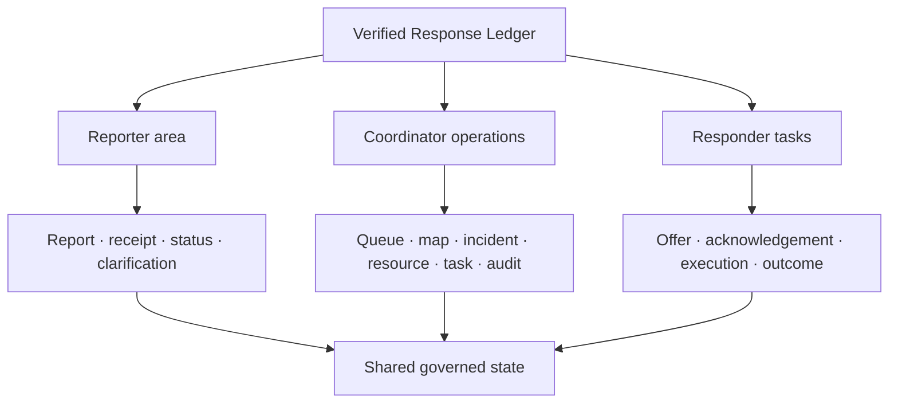
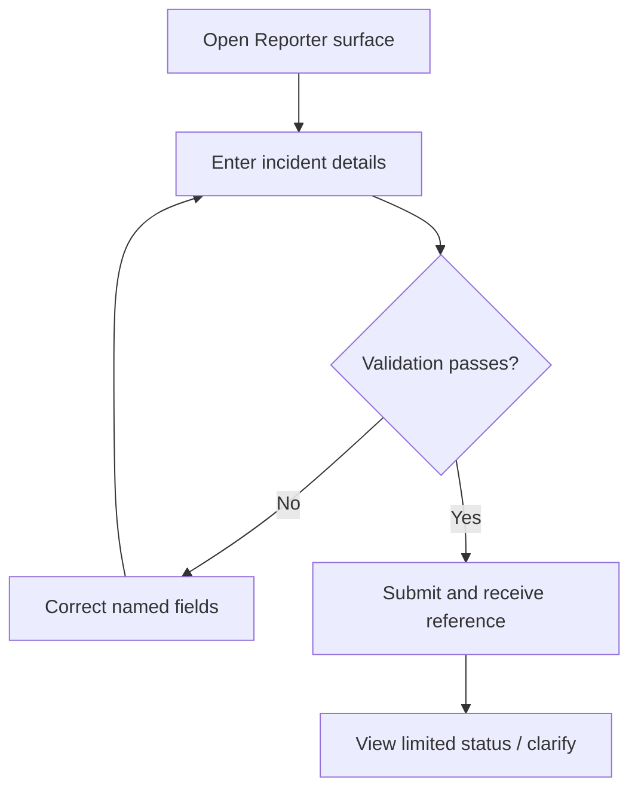
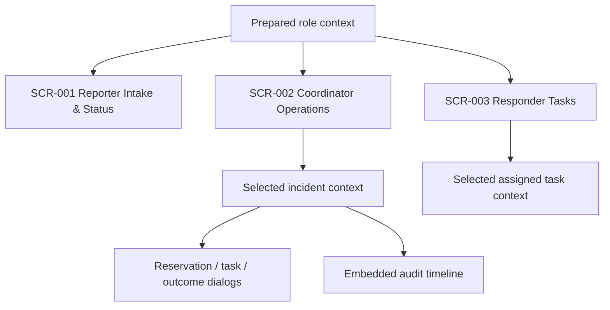

# Verified Response Ledger — UI/UX Specification

**Document:** `docs/06-UIUX.md`  
**Stage:** 6 — UI/UX Specification  
**Status:** Implementation-ready within the approved Scope Lock  
**Authority:** Original Problem Statement → `04-Scope_Lock.md` → `05-PRD.md` → supporting analysis  
**Evidence notation:** **[PS]** organizer requirement; **[LOCKED]** Scope Lock; **[PRD]** product behavior; **[DESIGN]** interaction decision derived here.

This document defines how authorized users interact with the locked product. It does not add product functionality, prescribe backend implementation, or claim that simulated crisis data is real.

---

# 1. UI/UX Baseline

| Item | Baseline |
|---|---|
| **Product** | Verified Response Ledger — neutral working name. |
| **Product definition** | A narrow full-stack GIS coordination prototype that binds incident verification, resource commitment, responsibility acknowledgement, structured updates, distribution/outcome state, and audit history. **[LOCKED]** |
| **Primary users** | Community Reporter; Agency Coordinator/Dispatcher; Volunteer/Responder. **[LOCKED]** |
| **Secondary users** | Resource Custodian and Supervisor/Auditor are represented through Coordinator actions; affected recipients are indirect. No separate interface is authorized. **[LOCKED]** |
| **Core user job** | Verify a reported need, commit genuinely available resources, transfer responsibility explicitly, and know whether the intended outcome was fully, partially, or not achieved. **[PRD]** |
| **Core workflow** | Report → validate → verify → inspect resource → reserve → assign/instruct → acknowledge → dispatch → full/partial/failed outcome → reconcile → consistent status/map/audit. |
| **Supporting workflows** | Verification/rejection; reporter clarification; reservation conflict; task handoff; partial outcome reconciliation; map awareness. P1 recovery flows remain conditional. |
| **Mandatory organizer requirements** | PS-R01 incident reporting; PS-R02 resource tracking; PS-R03 coordinated response; PS-R04 real-time geographic visibility. |
| **P0** | Persistence; human verification; authorization and valid transitions; atomic reservation; acknowledgement; outcome reconciliation; provenance/freshness/simulation labels; audit timeline; cross-view consistency. |
| **P1** | Duplicate review; decline/timeout/reassignment; stale-resource reconfirmation; operational list fallback; demo reset/invariant support. These are embedded or test-support capabilities, not new destinations. |
| **P2** | Recipient confirmation; validated multilingual labels; documented sample exchange; recorded alert overlay. No P2 UI is included in the required screen set. |
| **Explicit OUT** | General chat, AI/ML, notification center, analytics dashboard, profile/settings, onboarding wizard, live tracking/routes, payments, social features, external messaging, live government integrations, full offline sync, admin console, advanced search/filter/export, native app, decorative graphs. |
| **Main differentiator** | Reported ≠ verified; displayed available ≠ uncommitted; sent ≠ accepted; dispatched ≠ delivered; partial ≠ complete. |
| **Critical demo path** | Submit incident → see queue/map → verify → reserve 20 → reject competing reservation → offer task → responder accepts → dispatch 20 → report 12 delivered/8 exception → reconcile partial outcome → inspect consistent status, map, ledger, and audit. |
| **Environmental constraints** | Reporter and responder interactions may occur at mobile width; Coordinator work is desktop-primary; connectivity may be unreliable but full offline operation is not authorized; all identities, contacts, stock, and crisis events are synthetic; map/base failure must be visible and must not corrupt shared state. |

No UI/UX scope conflict is identified. The locked three-surface budget can support all Mandatory/P0 behavior.

---

# 2. UX Design Principles

| Principle | Derived from | UI consequence |
|---|---|---|
| **Action over analytics** | Core job and analytics OUT decision | The Coordinator sees actionable queue, map, resource, task, and outcome context—not KPI cards or decorative charts. |
| **State distinctions must be unmistakable** | Main differentiator; BR-001, BR-010, BR-013, BR-016 | Labels and permitted actions explicitly distinguish unverified/verified, offered/accepted, reserved/in-transit/delivered, and partial/complete. |
| **Evidence precedes high-impact action** | FR-018/019; human verification | Source, time, freshness, synthetic status, quantity, and current state appear beside verify, reserve, dispatch, and reconcile actions. |
| **The map is a governed view, not authority** | BR-021; FR-008–009 | Selecting a marker opens the same underlying incident/resource context; map interactions cannot silently change operational state. |
| **One task, one clear next action** | Field usability; screen budget | Each context exposes one dominant valid action; disabled/absent actions do not imply a transition is available. |
| **Critical actions name their consequence** | Scarce-resource allocation and final-state changes | Buttons say “Reserve 20 kits,” “Dispatch 20 kits,” or “Confirm partial outcome,” followed by concise consequence confirmation. |
| **Failures preserve and reveal truth** | BR-022; PRD failure rules | Failed writes never show success. Conflict, stale, permission, and dependency states state what changed, what did not, and how to recover. |
| **Structured coordination, not chat** | PS-R03 interpretation; general messaging OUT | Clarifications, instructions, acknowledgements, exceptions, and outcomes are contextual records tied to a report/task. |
| **Field actions are mobile-first; coordination is desktop-primary** | Role context and NFRs | Reporter and Responder flows use single-column, touch-ready controls; Coordinator workspace uses a desktop split view and a deliberate stacked mobile adaptation. |
| **Demo honesty is always visible** | FR-018; BR-020 | Synthetic identities, stock, locations, and recorded/simulated integrations carry persistent labels near the data they qualify. |

---

# 3. Actor → Task Analysis

| Actor | Goal | Authorized tasks | Frequency | Importance | Context and immediate information | Must not see |
|---|---|---|---|---|---|---|
| **Community Reporter** | Submit a need and know it entered an accountable process | Enter incident; choose/map location; submit; retain reference; view own limited status; add clarification | Episodic, urgent | Critical | Required fields, submission state, reference, public-safe status, last update, clarification history | Other reports, operational stock, responder identity, internal notes, full audit |
| **Agency Coordinator** | Convert an uncertain report into a verified, resourced, owned, and reconciled response | Review; verify/reject; inspect map/resource; reserve/release; offer task; monitor acknowledgement/execution; reconcile outcome; inspect audit | Repeated during an incident | Critical | Source/time, reported versus verified state, location, resource quantities/freshness, responder ownership, outcome remainder, audit history | Controls outside Coordinator authority; hidden “AI priority”; fabricated external certainty |
| **Volunteer / Responder** | Understand, accept, execute, and truthfully report an assigned task | View assigned offer; accept/decline; view instructions/location/quantity; dispatch; add progress/exception; submit outcome | Repeated while assigned | Critical | Assignment state, instructions, quantity, incident location/context, latest allowed action, prior own updates | Full resource pool, other responders’ tasks, reporter private contact, verify/reserve/reconcile controls |

Decision responsibilities:

- The Reporter decides whether the submitted details are accurate and whether clarification is needed.
- The Coordinator decides verification, reservation, assignment, and outcome reconciliation.
- The designated Responder decides acceptance and reports execution facts; the Responder does not independently confirm incident resolution.

---

# 4. Requirement → Interaction Analysis

| FR | Actor | Required user action | Required system feedback | Interaction needed |
|---|---|---|---|---|
| FR-001 | Reporter | Enter location, type, reporter severity, description, safe reference; submit | Inline validation, pending state, reference, Under Review status | Direct form interaction |
| FR-002 | Reporter | Open own submitted context | Limited status, reference, last update | Information display on same surface |
| FR-003 | Coordinator | Inspect resource pool | Available/reserved/in-transit/delivered, unit, source, freshness | Information display; no separate screen |
| FR-004 | Coordinator/Responder | Review/update distribution via permitted workflow actions | Visible quantity movement and current totals | Display plus state-changing actions |
| FR-005 | Reporter | Add non-empty linked clarification | Confirmation and appended attributable update | Contextual form |
| FR-006 | Coordinator | Select prepared responder, quantity, and enter instructions | Offered/Pending status and task reference | Structured task form |
| FR-007 | Responder | Submit progress, exception, or full/partial/failed outcome | Validated task/resource state and visible update | Contextual execution/outcome form |
| FR-008 | Coordinator | Pan, zoom, select markers, use locked simple state/type filter | Marker summary and linked selection | Interactive embedded map |
| FR-009 | System | No dedicated user action; refresh connected views | Map/queue/detail reflect persisted change or show stale/error | Shared feedback; no dedicated UI |
| FR-010 | System | No dedicated UI | Persisted values remain after navigation/reload/role change | Visible through all surfaces |
| FR-011 | Coordinator | Verify or reject; give rejection reason when required | Decision state, audit event, enabled/blocked downstream actions | Review action group and confirmation |
| FR-012 | All | Act only within role/ownership | Unauthorized controls hidden or read-only; direct attempts denied | Role-aware rendering and permission feedback |
| FR-013 | Coordinator/Responder | Choose only valid next action | Valid action availability; invalid attempt explanation | Contextual action gating |
| FR-014 | Coordinator | Enter positive reservation quantity and commit | Updated balance or conflict/insufficient-stock result | Quantity control plus confirmation/conflict dialog |
| FR-015 | Responder | Accept or decline own offer | Explicit Accepted/Declined timestamp; dispatch available only after acceptance | Acknowledgement control |
| FR-016 | Responder | Dispatch; later report outcome | Quantity-state movement and task-state change | Dispatch and outcome controls |
| FR-017 | Coordinator | Review submitted result; confirm partial/full/failure/follow-up | Reconciled totals, incident state, remaining work | Outcome review panel |
| FR-018 | All, role-limited | No special action | Source, time, freshness, synthetic/simulated labels | Inline evidence badges/metadata |
| FR-019 | Coordinator | Open history within selected context | Attributable ordered critical events | Embedded audit timeline |
| FR-020 | All | No special action | Same persisted state across permitted views; visible stale/error if not current | Cross-surface consistency feedback |

P1 FR-021–025 receive embedded interaction definitions later but do not create required screens. P2 FR-026–029 are not represented in the default UI.

---

# 5. Information Architecture



The architecture is role-oriented, not entity-dashboard-oriented:

- **Reporter area:** one intake/status surface; the receipt and status replace the form’s primary region after successful submission while allowing clarification.
- **Coordinator operations:** one workspace with queue/list, map, and selected-context panes. Resource, task, reconciliation, and audit are contextual sections or overlays—not navigation destinations.
- **Responder tasks:** one surface combining assigned-task list and active task detail.
- **Shared governed state:** not a screen; it is the source reflected consistently by the three authorized surfaces.

---

# 6. Navigation Model

**Model:** task-based, role-oriented navigation. This fits a three-role prototype and avoids an unnecessary global application hierarchy.

## Global navigation

- Compact product label.
- Current role/identity indicator.
- Persistent “Synthetic demo data” disclosure.
- A prepared role-context switch or direct role links may be exposed for the hackathon demo shell. It is not profile management, account switching, or an end-user feature.
- No notification bell, global search, settings, analytics, or marketing destination.

## Role-specific navigation

- Reporter: `Report / Status` is one destination.
- Coordinator: `Operations` is one destination; queue, map, and details are synchronized regions.
- Responder: `My Tasks` is one destination.

## Contextual navigation

- Selecting a queue row or map marker changes the Coordinator’s selected incident context without changing the primary destination.
- Selecting an assigned task changes the Responder’s task detail context.
- Audit, reservation, task offer, outcome review, and clarification are contextual expansions/dialogs within their owning surface.

## Back / return behavior

- Browser Back returns to the prior role surface/context without discarding successfully persisted work.
- Closing a dialog returns focus to its invoking control and retains the selected incident/task.
- On mobile, opening a detail replaces the list region; Back returns to the same scroll position and selection where practical.

## Mobile navigation

- Reporter and Responder use a single-column flow with a sticky or consistently placed current action.
- Coordinator uses the same information structure in stacked modes: queue/map overview → selected detail → contextual action. It is supported for inspection and emergency use, but desktop is primary.
- No separate mobile product or native navigation is introduced.

---

# 7. Complete Screen Derivation

| User task | FR(s) | Existing screen possible? | Required screen/view |
|---|---|:---:|---|
| Submit, receive reference, view own status, clarify | FR-001, 002, 005, 010, 012, 018, 020 | Yes; all form one reporter journey | SCR-001 Reporter Intake & Status |
| Review/verify reports and see geography | FR-008–013, 018–020 | Yes; synchronized regions in one workspace | SCR-002 Coordinator Operations Workspace |
| Inspect availability, reserve, handle conflict | FR-003, 004, 014, 018–020 | Yes; contextual resource section/dialog in SCR-002 | SCR-002 |
| Offer task/instructions | FR-006, 013, 014, 019 | Yes; contextual task form in SCR-002 | SCR-002 |
| Monitor acknowledgement and execution | FR-004, 015, 016, 020 | Yes; task state in SCR-002 plus responder detail in SCR-003 | SCR-002 and SCR-003 |
| Reconcile partial/full/failed outcome | FR-017–020 | Yes; selected incident/task outcome panel in SCR-002 | SCR-002 |
| Inspect critical audit | FR-019 | Yes; expandable timeline in SCR-002 | SCR-002 |
| View assigned offer, accept/decline, dispatch, update outcome | FR-007, 012, 013, 015, 016, 018–020 | Yes; one task surface | SCR-003 Responder Task Workspace |
| P1 duplicate/stale/fallback recovery | FR-021, 023, 024 | Yes; contextual components in SCR-002 if promoted | No additional screen |
| P1 decline/reassign | FR-022 | Yes; controls/state within SCR-002/003 if promoted | No additional screen |
| P1 demo reset/invariant check | FR-025 | Yes; test/demo support control outside end-user navigation | No product screen |

---

# 8. Final Screen Inventory

| ID | Screen / view | User | Purpose | Related FRs | Priority |
|---|---|---|---|---|---|
| **SCR-001** | Reporter Intake & Status | Community Reporter | Submit a locatable incident, receive a reference, see limited status, and add linked clarification | FR-001, 002, 005, 010, 012, 018, 020 | Mandatory/P0 |
| **SCR-002** | Coordinator Operations Workspace | Agency Coordinator | Verify reports, inspect map/resources, reserve, assign, reconcile, and inspect audit from one selected operational context | FR-003, 004, 006, 008–014, 017–020; conditional FR-021, 023–025 | Mandatory/P0 |
| **SCR-003** | Responder Task Workspace | Volunteer/Responder | Review own offers/instructions, acknowledge ownership, dispatch, and submit structured execution outcomes | FR-007, 010, 012, 013, 015, 016, 018–020; conditional FR-022 | Mandatory/P0 |

**TOTAL REQUIRED SCREENS: 3**  
**Mandatory/P0 screens: 3**  
**P1 screens: 0**  
**P2 screens: 0**

Dialogs, drawers, contextual panes, status receipts, and overlays are components—not separate screens.

---

# 9. Screen Necessity Test

| Screen | Requirement | Necessary? | Could merge? | Decision |
|---|---|:---:|---|---|
| SCR-001 | Reporter-only data entry and privacy-limited status | Yes | Cannot merge with restricted operations without confusing permissions and exposing data | Keep |
| SCR-002 | Coordinator owns verification, allocation, assignment, reconciliation, map, and audit | Yes | Its internal concerns should merge here; separating them would fragment the very workflow being repaired | Keep as one workspace |
| SCR-003 | Designated responder must personally acknowledge and update assigned work | Yes | Cannot merge with Coordinator because sent ≠ accepted and role separation must be real | Keep |

No screen exists solely for presentation, symmetry, or common dashboard convention.

---

# 10. Screen-to-Requirement Matrix

| Screen | PS requirement | FR | User story | Scope |
|---|---|---|---|---|
| SCR-001 | PS-R01, PS-R03 | FR-001, 002, 005, 010, 012, 018, 020 | US-001, US-002, US-011 | M-01, M-03, C-01, C-03, C-07, C-09 |
| SCR-002 | PS-R01, PS-R02, PS-R03, PS-R04 | FR-003, 004, 006, 008–014, 017–020 | US-003–006, US-009–011 | M-01–04, C-01–09 |
| SCR-003 | PS-R02, PS-R03 | FR-007, 010, 012, 013, 015, 016, 018–020 | US-007, US-008, US-011 | M-02, M-03, C-01, C-03, C-05–09 |

**User-facing Mandatory/P0 FRs:** 20  
**Covered by UI or explicit no-dedicated-UI feedback:** 20  
**Missing:** 0

---

# 11. Detailed Screen Specifications

## SCR-001 — Reporter Intake & Status

### Purpose

Enable a Community Reporter to create one locatable source report and, after submission, use the issued reference to understand its limited operational status and add a clarification. This screen is the only reporter-facing surface.

### Users

- Community Reporter: create and view only their permitted prototype context.
- Coordinator: may see the resulting report in SCR-002, but does not use SCR-001.

### Entry points

- Direct reporter route or prepared Reporter role link.
- Returning to the route with the current session/reference restores the permitted receipt/status context.

### Exit points

- Remain on the submitted receipt/status state.
- Return to a blank report state only through an explicit “Report another incident” reset of local form context; this does not delete the submitted report.
- No route into restricted Coordinator or Responder data.

### Related requirements

PS-R01, PS-R03; US-001, US-002; FR-001, FR-002, FR-005, FR-010, FR-012, FR-018, FR-020; M-01, M-03, C-01, C-03, C-07, C-09.

### Primary user goal

Submit accurate minimum details and obtain durable evidence that the report entered the response workflow.

### Information priority

- **Primary:** form or report reference; current public-safe status; successful/failed submission; next permitted action.
- **Secondary:** location summary, type, reporter-supplied severity, last visible update, linked clarifications.
- **Tertiary:** synthetic-data notice, source/time metadata, explanation that reporter severity is not agency verification.

### Component structure

```text
Reporter Intake & Status
├── ApplicationHeader
│   ├── ProductLabel
│   ├── CurrentRoleIndicator
│   └── SyntheticDataBanner
├── ReporterContext
│   ├── IncidentReportForm (before submission)
│   │   ├── LocationPicker
│   │   ├── ControlledTypeField
│   │   ├── ReporterSeverityField
│   │   ├── DescriptionField
│   │   └── SafeReferenceField
│   └── SubmissionReceiptStatus (after submission)
│       ├── ReferenceAndStatus
│       ├── SubmittedSummary
│       ├── VisibleUpdates
│       └── ClarificationComposer
└── ActionFeedbackRegion
```

### Actions

- **Primary:** `Submit incident` before submission; `Add clarification` when status exists.
- **Secondary:** adjust map point/manual approved location; copy report reference; start another blank report after current submission is safely persisted.
- **Destructive/critical:** none. Reporter cannot delete, verify, reject, allocate, cancel, or resolve.

### Inputs

| Field | Type | Required? | Validation | Error behavior |
|---|---|:---:|---|---|
| Incident location | Map point plus approved manual/seeded location choice | Yes | Must be interpretable within prototype map context | Keep entered values; associate error with field; no report created |
| Incident type | Controlled select/radio | Yes | Must match locked incident-family value | Explain valid choice; no submission |
| Reporter severity | Controlled select/radio | Yes | Must match locked scale; labelled “reported severity” | Explain that it is reporter-supplied and require valid value |
| Description | Multiline text | Yes | Non-empty and within supported limit | Inline error; preserve draft |
| Contact/reference | Text | Yes | Synthetic-safe prototype format; no real victim PII | Explain expected demo-safe value |
| Clarification | Multiline text | When used | Non-empty and authorized to own report | Do not append; retain text for correction/retry where safe |

### Data displayed

Reference, Submitted/Under Review or later public-safe status, submitted time, location summary, type, reported severity, description summary, permitted updates, clarification actor/time, and synthetic status. Internal stock, responder identity, operational notes, and full audit are excluded.

### Sorting / filtering / search

None. This is a single-report context; global or historical search is not authorized.

### Interaction behavior

1. Required fields validate on blur and again on submission.
2. Submission disables the primary action while unresolved to prevent accidental duplicate submission.
3. Success replaces the editable intake emphasis with a receipt/status region without implying verification.
4. Clarification appends a new attributable update; it never overwrites the original report.
5. Connected status changes update the visible status or show a stale/retry indicator; the screen never invents a newer state.

### Confirmation behavior

No confirmation dialog is required before submission because the report is non-destructive and remains unverified. The submit button names the action. If the user tries to start another report with unsaved form content, use a lightweight unsaved-changes confirmation.

### Success behavior

Show the reference prominently, the exact `Submitted / Under Review` label, a persisted submitted summary, and the next available clarification action. A transient confirmation may supplement—but never replace—the durable receipt.

### Error behavior

Validation errors appear adjacent to fields and in a focusable summary when multiple errors exist. Persistence failure states that the report was not saved. Status retrieval failure is distinguished from “no report.” Retry does not create a duplicate if prior success is already known.

### Permission behavior

Only the current reporter’s permitted report context is shown. Invalid or unauthorized references return a non-leaking unavailable/permission state. Verification, allocation, task, responder, and audit controls are absent.

### Navigation behavior

The screen maintains one surface with intake and receipt/status modes. Browser refresh restores persisted status when the prepared context/reference permits. No internal tabs are required.

### Responsive behavior

Mobile is primary: fields stack; map/location picker uses a bounded region; primary action remains easy to reach without obscuring validation. Desktop limits line length and form width while keeping the status/evidence panel adjacent only when space permits.

### Accessibility notes

Use a semantic form, persistent visible labels, programmatic required/error association, descriptive severity options, keyboard-operable location alternatives, a focus move to the receipt heading on success, and a live region for submission status. Map use cannot be the sole way to provide a supported location.

### Demo importance

**Critical.** It proves real incident input, persistence, receipt, structured community communication, and propagation into shared state.

---

## SCR-002 — Coordinator Operations Workspace

### Purpose

Provide a single, state-connected workspace for reviewing incoming reports, seeing geographic context, verifying incidents, committing resources, offering work, monitoring handoff/execution, reconciling outcomes, and inspecting evidence.

### Users

- Agency Coordinator/Dispatcher only.
- Resource Custodian and Supervisor/Auditor are represented through Coordinator-authorized actions; no distinct interface.

### Entry points

- Direct Coordinator role route/prepared identity.
- Deep context from the demo shell may select a known incident, but must still enforce authorization and load the same workspace.

### Exit points

- Select another report/incident in the same workspace.
- Switch prepared role context for the demo.
- Close a contextual dialog/drawer and return to the selected incident.

### Related requirements

PS-R01–04; US-003–006, US-009–011; FR-003, FR-004, FR-006, FR-008–014, FR-017–020; conditional FR-021, FR-023–025; M-01–04, C-01–09.

### Primary user goal

Move one trustworthy, selected operational context from unverified report through resource-backed assignment to reconciled outcome without losing state, ownership, quantity, or provenance.

### Information priority

- **Primary:** selected incident status and next valid decision; current resource availability; task ownership/execution state; unresolved outcome quantity.
- **Secondary:** queue/map geography; report evidence; responder/instructions; distribution breakdown; conflict and freshness conditions.
- **Tertiary:** audit detail, complete provenance, synthetic/simulated labels, non-selected records.

### Component structure

```text
Coordinator Operations Workspace
├── ApplicationHeader
│   ├── ProductLabel
│   ├── CurrentRoleIndicator
│   └── SyntheticDataBanner
├── OperationsOverview
│   ├── ReportQueue
│   └── OperationalMap
├── SelectedContext
│   ├── IncidentReviewPanel
│   ├── ResourceLedgerSummary
│   │   ├── QuantityBreakdown
│   │   └── ReservationControl
│   ├── TaskOfferOrTaskDetail
│   ├── ReconciliationSummary
│   └── AuditTimeline
├── ContextualOverlays
│   ├── ConfirmDialog
│   └── ReservationConflictDialog
└── ActionFeedbackRegion
```

### Actions

- **Primary, state-dependent:** `Verify report`, `Reserve N kits`, `Offer task`, `Confirm partial outcome`, or the single next valid operational action.
- **Secondary:** reject with reason; release/cancel within locked transitions; select marker/row; pan/zoom; use locked simple type/state filter; inspect source/freshness; open audit; review outcome evidence.
- **Destructive/high-impact:** reject report; reserve scarce stock; release/cancel commitment/task; confirm final/partial outcome. Each requires explicit consequence framing and, where state or quantity changes materially, confirmation.

### Inputs

| Field | Type | Required? | Validation | Error behavior |
|---|---|:---:|---|---|
| Verification decision | Verify/Reject choice | Yes when deciding | Coordinator role; report Under Review | Deny without change; refresh current state |
| Rejection/cancellation reason | Concise text | When rejecting/cancelling | Non-empty when required | Block action; retain text |
| Reservation quantity | Integer | Yes | Positive; ≤ current available; incident Verified | Show current requested/available context; do not partially reserve |
| Assigned responder | Prepared identity select | Yes for offer | Exists/eligible in fixture | Block offer |
| Task instructions | Structured concise text | Yes | Non-empty | Block offer and focus error |
| Task quantity | Integer/derived committed amount | Yes | Consistent with valid commitment | Block offer |
| Coordinator outcome decision | Controlled state action | Yes when reconciling | Outcome exists; quantities reconcile | Prevent false closure and state why |
| Map filter | Locked type/state values | No | Recognized values only | Ignore/reject invalid filter without state change |
| P1 reconfirmed quantity/source | Integer plus source/time/reason | Conditional | Authorized, non-negative, internally consistent | Leave resource stale |

### Data displayed

- Report: reference, source, submitted time, location, type, reporter severity, description, clarifications, verification state.
- Incident: canonical identifier, status, selected geography, current response state.
- Resource: one relief-kit pool; available, reserved, in transit, delivered, released/exception; source, last updated, freshness, synthetic label.
- Task: responder, instructions, quantity, Offered/Accepted/Dispatched/outcome state, relevant times and exceptions.
- Outcome: dispatched, delivered, remainder, reason, Coordinator decision/follow-up.
- Audit: actor, timestamp, prior/new state, quantity movement, reason/reference.
- Map: incident/resource marker, type/state, freshness/simulation label, linked identifier.

### Sorting / filtering / search

- Queue default ordering: newest relevant reports first, with current state visible.
- Only the locked simple type/state filter may affect queue/map context.
- No advanced search, saved filter, analytics grouping, heat map, or custom reporting.

### Interaction behavior

1. Queue-row and map-marker selection set one shared selected incident context.
2. Verify/reject is available only for Under Review reports. Verification changes the action region and adds an audit event.
3. Resource quantities and evidence appear before reservation. The action label includes the entered quantity.
4. Reservation rechecks current availability at commit. A conflict preserves the winning commitment and shows refreshed truth.
5. Task offer is unavailable until a valid commitment exists. Offered status explicitly says “Awaiting responder acknowledgement.”
6. Responder acceptance/dispatch/outcome changes appear in the selected context without manual data edits or contradictory intermediate labels.
7. A partial result foregrounds `12 delivered / 8 unresolved` and disallows full closure until the remainder is explicitly handled.
8. Audit is a contextual expandable section/drawer and preserves selected context.

### Confirmation behavior

- `Verify`: concise confirmation only if needed to prevent accidental authorization; show source report identifier.
- `Reject`: require reason and confirm that allocation/task actions will remain unavailable.
- `Reserve N kits`: confirm incident, amount, current available balance, and projected remaining available.
- `Release/Cancel`: confirm affected task/quantity and require reason where locked rules require it.
- `Confirm full/partial/failed outcome`: show dispatched, delivered, unresolved/exception quantity, and resulting incident/resource states.

### Success behavior

The persisted state changes in the selected context, resource breakdown, task status, map/queue, and audit. A concise announcement may supplement the durable new state. Focus returns to the updated state heading or logical next action.

### Error behavior

- Insufficient stock/conflict: explain that availability changed, show the current balance, and offer `Refresh and adjust`; never show a temporary success.
- Invalid transition: explain the prerequisite state and preserve current state.
- Stale data: label the affected record and prevent unsupported claims; P1 reconfirm only if implemented.
- Map/base failure: mark the geographic region unavailable without changing operational records; conditional P1 list fallback may remain usable.
- Audit failure during a critical operation: do not present the operation as fully complete.

### Permission behavior

Only Coordinator-authorized actions are shown. The Coordinator cannot accept a task on behalf of a responder. Direct unauthorized attempts receive a permission result without exposing restricted data. Full operational state remains unavailable to Reporter and Responder contexts.

### Navigation behavior

Selection changes context in place. Desktop uses persistent overview and selected-context regions; mobile uses overview → detail drill-in and Back to return. Overlays close back to the invoking context. Audit and resource detail never become top-level destinations.

### Responsive behavior

Desktop is primary: queue and map share the overview region; selected context occupies a stable adjacent/below panel sized for task work. Tablet stacks overview over detail with a selection summary. Mobile presents queue/map mode first, then a full-width selected-context view with deliberate progressive disclosure; dense quantity tables transform into labelled rows. Critical actions remain reachable but never cover evidence.

### Accessibility notes

Queue/map selection must have equivalent non-map controls. Markers need accessible names containing type/state, and map keyboard operation must not trap focus. Split panes preserve logical DOM order. Status, freshness, and quantities use text—not color alone. Dialog focus is trapped/restored; dynamic connected updates are announced politely without stealing focus.

### Demo importance

**Critical.** It carries all four organizer requirements and exposes the differentiator: verification, atomic commitment, explicit ownership, quantity reconciliation, and audit.

---

## SCR-003 — Responder Task Workspace

### Purpose

Enable the designated Volunteer/Responder to understand an offered task, explicitly accept or decline it, mark dispatch, and report progress, exception, or reconciled full/partial/failed outcome.

### Users

- Volunteer/Responder for tasks assigned to the current prepared identity.
- Coordinator observes resulting state from SCR-002 but does not operate this screen as the responder.

### Entry points

- Direct Responder role route/prepared identity.
- Selecting an offered or active item in the responder’s task list.

### Exit points

- Return to the responder task list context.
- Remain on the completed/partial/failed task evidence after submission.
- Switch prepared role context in the demo shell.

### Related requirements

PS-R02, PS-R03; US-007, US-008, US-011; FR-007, FR-010, FR-012, FR-013, FR-015, FR-016, FR-018–020; conditional FR-022; M-02, M-03, C-01, C-03, C-05–09.

### Primary user goal

Know exactly what has been offered, take ownership explicitly, and report what actually happened without overstating delivery.

### Information priority

- **Primary:** task state, next valid action, assigned quantity, instructions, incident location.
- **Secondary:** incident type/context, current resource distribution state, responder’s own update/outcome history.
- **Tertiary:** source/freshness/synthetic labels and task timestamps.

### Component structure

```text
Responder Task Workspace
├── ApplicationHeader
│   ├── ProductLabel
│   ├── CurrentRoleIndicator
│   └── SyntheticDataBanner
├── AssignedTaskList
├── ActiveTaskDetail
│   ├── TaskStatusAndInstructions
│   ├── AssignedLocationContext
│   ├── TaskAcknowledgementControl
│   ├── DispatchControl
│   ├── ProgressOrExceptionComposer
│   ├── OutcomeForm
│   └── OwnTaskHistory
└── ActionFeedbackRegion
```

### Actions

- **Primary, state-dependent:** `Accept task`, `Dispatch N kits`, or `Submit outcome`.
- **Secondary:** decline with reason if the locked happy path exposes decline; submit structured progress/exception; select another assigned task.
- **Destructive/high-impact:** decline or report failure affects coverage; dispatch and outcome move scarce-resource state. Use clear consequence confirmation, not generic “Are you sure?” copy.

### Inputs

| Field | Type | Required? | Validation | Error behavior |
|---|---|:---:|---|---|
| Acknowledgement | Accept/Decline | Yes when responding | Task is Offered to current responder | Deny if reassigned/cancelled/already decided; show current state |
| Decline reason | Concise text | If decline path is implemented | Non-empty when required | Block decline; retain entry |
| Dispatch quantity | Integer, defaulted to assigned quantity where appropriate | Yes | Positive; ≤ reserved/assigned; task Accepted | Reject without resource movement |
| Progress/exception update | Structured concise text | When action used | Non-empty and task permits update | Do not append invalid update |
| Outcome type | Full/Partial/Failed | Yes | Compatible with current task state | Explain valid choices |
| Delivered quantity | Integer | Full/Partial | 0 through dispatched; full must reconcile | Reject inconsistent quantity |
| Exception/reason | Multiline text | Partial/Failed | Non-empty | Block outcome submission |

### Data displayed

Own offered/active tasks; assigned responder identity; task/incident reference; current state; instructions; assigned/dispatched quantity; incident type/location; permitted map/location context; source/time/freshness/synthetic labels; responder’s own update history; final submitted outcome. The full stock pool and other responders’ work are excluded.

### Sorting / filtering / search

Tasks group by actionable state (offered/active before completed) with newest relevant items first. No advanced search/filter is required.

### Interaction behavior

1. Offered task opens with instructions, quantity, location, and explicit “No accepted owner yet” state.
2. Acceptance revalidates assignment and changes the durable state to Accepted before dispatch appears.
3. Dispatch revalidates accepted state and assigned/reserved quantity; success changes quantity to In Transit.
4. Outcome selection conditionally reveals delivered quantity and exception requirements.
5. Partial submission calculates and displays the remainder before commit; the responder confirms the facts, not incident resolution.
6. Completion evidence remains visible after submission; the Coordinator’s reconciliation state is separately labelled.

### Confirmation behavior

- Acceptance may use an inline commitment summary rather than a modal if all details remain visible.
- Decline, dispatch, partial/full outcome, and failure require a concise review of the resulting state.
- A partial outcome confirmation states: `12 of 20 delivered; 8 will remain unresolved with this reason.`

### Success behavior

Show the durable task state, timestamp, quantity movement, and next valid action. Do not rely on a toast. After an outcome, show “Submitted for Coordinator reconciliation” when confirmation is still pending.

### Error behavior

Wrong actor, cancelled/reassigned task, stale task, duplicate acceptance, invalid quantity, and persistence failure each preserve the prior valid state. The user sees what changed externally and may refresh/return. Technical error text is not exposed.

### Permission behavior

The current responder sees only assigned task context. Verify, reserve, select another responder, reconcile, and full operational-map controls are absent. Direct attempts against another responder’s task are denied.

### Navigation behavior

Desktop/tablet may show a compact task list beside detail. Mobile uses list → detail. Returning from detail preserves list position. Once a modal closes, focus returns to the invoking action.

### Responsive behavior

Mobile is primary. Instructions and quantity precede actions; touch controls are full-width when useful; location context is bounded and has text equivalent; numeric keyboard is requested for quantities; conditional outcome fields appear without horizontal scrolling.

### Accessibility notes

Task state is a heading-level summary and text badge. Action changes are announced. Conditional form fields receive focus only when revealed by the user’s choice. Location has a text address/coordinate summary. Confirmation dialogs manage focus and expose quantity/remainder in readable text.

### Demo importance

**Critical.** It proves that a sent task is not accepted until the designated responder acts and that dispatch/outcome facts change shared state truthfully.

---

# 12. Screen States

## SCR-001 states

| State | Trigger | What the user sees | Available actions |
|---|---|---|---|
| Default | No submitted context | Empty incident form, location control, synthetic-data notice | Complete form |
| Validation error | Invalid submit | Field-level errors plus focusable summary; draft preserved | Correct and resubmit |
| Submitting | Valid submit initiated | Local busy indicator; submit disabled; entered summary remains visible | Wait; no duplicate submit |
| Success / Under Review | Persisted report | Reference, exact status, submitted summary, clarification control | Copy reference; add clarification |
| Later status | Shared state changed | Public-safe verified/active/partial/resolved/rejected status and last visible update | Add clarification when permitted |
| Empty status | Valid context has no retrievable permitted record | Explanation that no report is available for this context | Return to intake/check reference |
| System error | Save/read failed | What failed, whether anything was saved, retry guidance | Retry or return without false success |
| Permission denied | Invalid/foreign reference | Non-leaking access message | Return to own context |
| Stale | Connected update cannot be confirmed | Last-known status with timestamp and “may be out of date” label | Refresh/retry; avoid acting on inferred state |
| Clarification success | Linked update saved | New update in history with time; original unchanged | Continue viewing status |

## SCR-002 states

| State | Trigger | What the user sees | Available actions |
|---|---|---|---|
| Loading | Workspace/shared state fetch | Stable shell with labelled loading regions; no misleading zero values | Wait/retry on failure |
| Empty queue | Successful fetch, no reports | “No reports awaiting review” and map/resource context as available | Inspect existing active context if any |
| Populated / no selection | Reports/resources loaded | Queue and map; prompt to select one record | Select row/marker; map navigation |
| Under Review selected | New report selected | Source evidence, unverified status, verify/reject actions; allocation disabled | Verify or reject |
| Verified selected | Verified incident | Available resource, source/freshness, reserve action | Reserve valid quantity |
| Reservation conflict | Stock changed during commit | Requested quantity, current availability, preserved winning state | Refresh, adjust, retry |
| Awaiting acknowledgement | Task offered | Responder/instructions/quantity plus “No accepted owner yet” | Monitor; P1 cancel/reassign only if built |
| Response active | Accepted/dispatched task | Ownership, in-transit quantity, updates, current next action owned by Responder | Inspect; no impersonated acceptance |
| Outcome awaiting review | Responder submitted outcome | Full/partial/failed facts, quantities, reason, evidence | Confirm appropriate result/follow-up |
| Partial resolved | Coordinator confirmed partial | Delivered and unresolved quantities are equally visible; incident Partially Resolved | Inspect audit; future follow-up only if authorized |
| System error | Data/action failure | Affected region and last valid state; no false success | Retry/refetch; stop critical action if truth uncertain |
| Permission denied | Non-Coordinator/direct attempt | Restricted message without operational data | Return to authorized area |
| Stale / partial data | Metadata old or one region failed | Timestamp/freshness labels; failed region isolated | Refresh; P1 reconfirm/fallback only if implemented |
| Map unavailable | Renderer/base context failed | Map error region; operational state preserved | Retry; P1 list fallback if built |
| Connected update | Another role changes selected state | Updated state/quantities plus subtle change announcement | Continue from new valid action |

## SCR-003 states

| State | Trigger | What the user sees | Available actions |
|---|---|---|---|
| Loading | Assigned tasks fetch | Labelled task-list/detail loading | Wait/retry |
| Empty | Successful fetch, no tasks | “No tasks assigned to this responder” | Refresh later; no fabricated work |
| Offered | Own new task | Instructions, quantity, location, Pending Acknowledgement state | Accept; decline if path implemented |
| Accepting | Accept in progress | Control busy; task facts remain visible | Wait; no repeated action |
| Accepted | Acknowledgement saved | Accepted time and dispatch prerequisite satisfied | Dispatch |
| In progress | Dispatch saved | In-transit quantity, progress/exception/outcome controls | Add update; submit outcome |
| Outcome validation error | Invalid quantity/reason | Specific field errors and unchanged task/resource state | Correct and resubmit |
| Outcome submitted | Valid outcome persisted | Full/partial/failed result, quantity/remainder, “Awaiting/received Coordinator reconciliation” | View own history |
| Conflict / stale | Task cancelled/reassigned/changed | Current external state and effect on attempted action | Refresh/return; no invalid retry |
| Permission denied | Wrong task/identity | Non-leaking denial | Return to assigned tasks |
| System error | Fetch/save failed | What failed and whether state changed | Retry after refresh; no duplicate movement |

No AI Processing or AI Uncertain states exist because AI is explicitly out of scope. “Offline” is not an operating mode; loss of connectivity is represented as a network/system error with no promise of queued synchronization.

---

# 13. Role-Based User Flows

## Community Reporter

**Trigger:** A community member observes an incident.  
**Preconditions:** Reporter role is active; only synthetic-safe data is used.

**Happy path:** Enter required details → validate → submit → receive reference and Under Review status → later see public-safe state → add clarification → see clarification appended.

**Alternative path:** Change the chosen location before submission; after a successful report, start a separate blank report without altering the first.

**Failure path:** Missing/invalid fields remain editable; a save failure explicitly says the report was not confirmed; an unauthorized reference reveals no record data.

**Completion state:** A persisted source report exists with a reference, current permitted status, and attributable clarification history.

**Related FRs:** FR-001, 002, 005, 010, 012, 018, 020.



## Agency Coordinator

**Trigger:** A submitted report appears in shared state.  
**Preconditions:** Coordinator identity is active; report and resource records loaded.

**Happy path:** Select report in queue/map → review source/evidence → verify → inspect one relief-kit pool → reserve valid quantity → offer structured task → observe responder acceptance and dispatch → review outcome → reconcile partial/full/failed state → inspect audit.

**Alternative path:** Reject a report with reason; release/cancel within allowed states; select a different record; P1-only review of duplicate/stale conditions if promoted.

**Failure path:** Unauthorized or invalid transitions are denied; reservation conflicts show current balance; map failure does not alter records; audit failure prevents claiming a fully successful critical action.

**Completion state:** Incident, task, resource quantities, map summary, reporter-visible state, and audit agree on the reconciled outcome.

**Related FRs:** FR-003, 004, 006, 008–014, 017–020.

## Volunteer / Responder

**Trigger:** A task is offered to the current responder.  
**Preconditions:** Task is still Offered to that responder and contains valid commitment/instructions.

**Happy path:** Select offer → review instructions/location/quantity → accept → dispatch committed quantity → submit full/partial/failed outcome with required facts → see persisted outcome and reconciliation status.

**Alternative path:** Decline with reason if the P1 recovery workflow is implemented; submit a structured progress/exception update before outcome.

**Failure path:** Wrong actor, cancelled/stale task, skipped acceptance, invalid quantity, or save failure leaves prior valid state intact and explains recovery.

**Completion state:** The responder’s acceptance, dispatch, and actual outcome are attributable and visible in the shared workflow.

**Related FRs:** FR-007, 010, 012, 013, 015, 016, 018–020.

---

# 14. Core End-to-End Flow

```mermaid
sequenceDiagram
    participant R as Reporter
    participant S as System
    participant C as Coordinator
    participant V as Responder
    R->>S: Submit location, type, severity, details
    S-->>R: Reference + Under Review
    S-->>C: Queue/map show unverified report
    C->>S: Verify; reserve 20; offer task
    S-->>V: Offered task + instructions
    V->>S: Accept; dispatch 20
    V->>S: Report 12 delivered, 8 exception
    S-->>C: Partial outcome awaiting review
    C->>S: Confirm partial result
    S-->>R: Limited Partially Resolved status
```

The system must visibly reject a competing 10-kit reservation after 20 kits are committed. That rejection is a core proof, not an incidental error state. Every transition occurs from persisted state and leaves attributable evidence.

---

# 15. Navigation Map



Role restrictions:

- SCR-001 exposes reporter-safe data only.
- SCR-002 requires Coordinator authorization.
- SCR-003 exposes only tasks assigned to the current Responder.
- The prepared role context is a demo/session mechanism, not a settings screen or user-management feature.

---

# 16. Component Inventory

| ID | Component | Purpose | Used on | Variants |
|---|---|---|---|---|
| CMP-001 | Application Header | Product/role context without extra navigation | All | Desktop, compact mobile |
| CMP-002 | Synthetic Data Banner | Persistent demo-honesty disclosure | All | Global; inline data-specific |
| CMP-003 | Status Badge | Communicate lifecycle state beyond color | All | Report, incident, task, resource |
| CMP-004 | Freshness Badge | Show fresh/stale/reconfirmed/unknown | SCR-002/003 | Compact, detailed |
| CMP-005 | Simulation Label | Mark synthetic/simulated/recorded data | All | Banner, inline |
| CMP-006 | Action Feedback Region | Accessible pending/success/error announcements | All | Inline, page summary |
| CMP-007 | Loading Placeholder | Show a bounded operation in progress | All | Region skeleton, action spinner |
| CMP-008 | Empty State Panel | Explain valid lack of data | All | Reporter/task/queue/map context |
| CMP-009 | Error State Panel | Explain failure, impact, recovery | All | Inline region, blocking |
| CMP-010 | Incident Report Form | Capture PS-R01 inputs | SCR-001 | Blank, validation error, submitting |
| CMP-011 | Location Picker | Capture/confirm supported geographic point | SCR-001 | Map input, manual/seeded alternative |
| CMP-012 | Submission Receipt & Status | Durable reference and permitted status | SCR-001 | Under Review, active, partial, resolved, rejected |
| CMP-013 | Clarification Composer | Append linked reporter clarification | SCR-001 | Editing, saving, saved/error |
| CMP-014 | Report Queue | Select operational report context | SCR-002 | Empty, populated, stale/error |
| CMP-015 | Operational Map | Pan/zoom/select current report/resource markers | SCR-002 | Loading, populated, unavailable |
| CMP-016 | Incident Review Panel | Present evidence and verify/reject actions | SCR-002 | Under Review, verified, rejected |
| CMP-017 | Resource Ledger Summary | Present one pool and distribution states | SCR-002 | Current, stale, unavailable |
| CMP-018 | Quantity Breakdown | Show reconciled available/reserved/in-transit/delivered/exception | SCR-002/003 | Compact, detailed |
| CMP-019 | Reservation Control | Enter/review/commit resource quantity | SCR-002 | Eligible, disabled, pending, conflict |
| CMP-020 | Task Offer Form | Create structured offer | SCR-002 | Eligible, invalid, submitted |
| CMP-021 | Task Card / Detail | Present offer/execution context | SCR-002/003 | Offered, accepted, active, final |
| CMP-022 | Task Acknowledgement Control | Accept/decline assigned offer | SCR-003 | Pending, saving, decided/conflict |
| CMP-023 | Dispatch Control | Move accepted committed quantity to In Transit | SCR-003 | Eligible, pending, complete/error |
| CMP-024 | Outcome Form | Submit full/partial/failed execution facts | SCR-003 | Conditional fields by outcome type |
| CMP-025 | Reconciliation Summary | Review and confirm outcome quantities | SCR-002 | Full, partial, failed, invalid |
| CMP-026 | Audit Timeline | Show attributable critical events | SCR-002; own-task subset SCR-003 | Collapsed, expanded, error |
| CMP-027 | Consequence Confirmation Dialog | Confirm high-impact state change | SCR-002/003 | Verify, reserve, release/cancel, dispatch, outcome |
| CMP-028 | Reservation Conflict Dialog | Explain lost race/current balance | SCR-002 | Insufficient, concurrent change |
| CMP-029 | Permission Denied Panel | Non-leaking authorization feedback | All | Page/region action denial |
| CMP-030 | Duplicate Review Panel | P1 human link/keep separate | SCR-002 | Candidate, linked, unlinked |
| CMP-031 | Resource Reconfirm Dialog | P1 freshness update | SCR-002 | Stale, reconfirming, confirmed/error |
| CMP-032 | Operational List Fallback | P1 map failure continuity | SCR-002 | Available only if FR-024 promoted |
| CMP-033 | Demo Reset / Invariant Control | P1 repeatable test support | Demo/test shell | Hidden from normal end-user navigation |

---

# 17. Important Component Specifications

## CMP-003 — Status Badge

- **Purpose:** Make current lifecycle semantics scannable without replacing full state text.
- **Information:** Status name; optional short contextual qualifier such as “Awaiting responder.”
- **States:** Defined in Section 18.
- **Actions:** None by default; it is not a dropdown unless a locked transition control invokes a separate action.
- **Variants:** Report, incident, task, resource, freshness.
- **Permission:** Same label may appear to multiple roles, but detail is role-limited.
- **Responsive:** Never truncate the semantic distinction; wrap or use a shorter approved label.
- **Accessibility:** Text is always present; icon is decorative or has matching text; contrast is checked.
- **Screens:** All.

## CMP-015 — Operational Map

- **Purpose:** Provide at-a-glance geographic awareness from the same governed records.
- **Information:** Incident/resource location, type, current state, freshness/source, synthetic label, selected identifier.
- **States:** Loading, empty, populated, partial data, base/renderer unavailable.
- **Actions:** Pan, zoom, keyboard-accessible selection, marker selection, locked simple type/state filter.
- **Variants:** Desktop primary; bounded stacked mobile.
- **Permission:** Full map Coordinator-only; Responder receives only assigned location context outside this component.
- **Responsive:** Preserve selection and provide list/text equivalent; controls do not cover critical marker summary.
- **Accessibility:** Accessible marker names; keyboard alternative via queue/list; logical focus order; no color-only marker meaning.
- **Screens:** SCR-002.

## CMP-019 — Reservation Control

- **Purpose:** Commit a valid quantity without over-promising.
- **Information:** Incident, unit, current available, requested, projected remaining, freshness/source.
- **States:** Ineligible, eligible, validating, committing, success, insufficient, conflict, error.
- **Actions:** Enter quantity; review; reserve; refresh/adjust after conflict.
- **Variants:** Standard reservation; release/cancel if allowed by current state.
- **Permission:** Coordinator only; available only for Verified/Response Active incident under valid transition.
- **Responsive:** Summary precedes numeric input; confirmation is readable at mobile width.
- **Accessibility:** Numeric label includes unit; error identifies available amount; focus returns to quantity on conflict.
- **Screens:** SCR-002.

## CMP-022 — Task Acknowledgement Control

- **Purpose:** Make ownership transfer explicit.
- **Information:** Designated responder, offered time, instructions/quantity reference, current ownership statement.
- **States:** Pending, accepting, accepted, declined, cancelled/reassigned conflict.
- **Actions:** Accept; decline if exposed by authorized scope.
- **Variants:** Inline commitment on mobile/desktop.
- **Permission:** Only designated Responder; Coordinator sees read-only state.
- **Responsive:** Actions follow essential task facts and remain distinct.
- **Accessibility:** Buttons have explicit names; pending/result announced; destructive decline wording is specific.
- **Screens:** SCR-003; read-only status on SCR-002.

## CMP-024 — Outcome Form

- **Purpose:** Capture execution truth without silently treating dispatch as delivery.
- **Information:** Dispatched amount, outcome type, delivered amount, calculated remainder, exception/reason.
- **States:** Default, conditional full/partial/failed, validation error, submitting, success, conflict.
- **Actions:** Choose outcome; enter quantity/reason; review; submit.
- **Variants:** Full, partial, failed.
- **Permission:** Designated Responder while task is In Progress.
- **Responsive:** Conditional fields stack; calculated remainder stays adjacent to delivered input.
- **Accessibility:** Outcome choice uses labelled controls; conditional field relationships announced; error summary links to fields.
- **Screens:** SCR-003.

## CMP-025 — Reconciliation Summary

- **Purpose:** Help the Coordinator confirm only a quantity-consistent operational result.
- **Information:** Committed, dispatched, delivered, unresolved/exception, proposed incident/resource states, responder reason.
- **States:** Awaiting review, full eligible, partial eligible, failed eligible, inconsistent/blocked, confirmed.
- **Actions:** Confirm the valid result or leave/follow up within locked workflow.
- **Permission:** Coordinator only.
- **Responsive:** Quantities become vertically labelled facts on narrow screens.
- **Accessibility:** State change is described in words; confirmation dialog repeats material consequence.
- **Screens:** SCR-002.

## CMP-026 — Audit Timeline

- **Purpose:** Expose critical evidence without creating an analytics/admin surface.
- **Information:** Event, actor, timestamp, previous/new state, quantity movement, reason/reference, synthetic/simulated context where relevant.
- **States:** Collapsed, loading, populated, unavailable/incomplete.
- **Actions:** Expand/collapse; no delete/edit.
- **Permission:** Full timeline Coordinator-only; Responder may see own task history subset.
- **Responsive:** Single vertical sequence; avoid wide change tables on mobile.
- **Accessibility:** Ordered semantic list; timestamps readable; changed values expressed in text.
- **Screens:** SCR-002; subset SCR-003.

---

# 18. Status System

Every status combines text, consistent icon/shape where useful, and semantic color. Color is never the only carrier.

| Status | Meaning | User interpretation | Allowed actions |
|---|---|---|---|
| Report — Under Review | Submitted but not authorized | “Received; no allocation authority yet” | Coordinator verify/reject; Reporter clarify |
| Report — Linked | Source report belongs to canonical incident | “Preserved and connected” | View/clarify per role |
| Report — Rejected | Coordinator rejected source for action | “Will not progress automatically” | View; clarification does not reopen |
| Incident — Unverified | Operational representation not authorized | “Do not allocate” | Coordinator verify/reject |
| Incident — Verified | Authorized need, not yet active response | “Eligible for commitment” | Coordinator reserve/task when valid |
| Incident — Response Active | Valid commitment/task exists | “Response underway” | Monitor/reconcile/cancel where valid |
| Incident — Partially Resolved | Some outcome achieved; remainder explicit | “Do not treat as complete” | Follow-up/complete remaining if authorized |
| Incident — Resolved | Reconciled full outcome | “No unexplained remainder” | View/audit only |
| Incident — Cancelled | Authorized response cancelled with handling | “No active response” | View/audit only |
| Task — Offered | Sent, awaiting designated responder | “No accepted owner yet” | Assigned responder accept/decline |
| Task — Accepted | Responder owns task; not dispatched | “Owner confirmed” | Responder dispatch |
| Task — In Progress | Dispatched/active execution | “Not yet delivered” | Responder update/outcome |
| Task — Partially Completed | Delivered portion and exception recorded | “Remainder exists” | Coordinator reconcile |
| Task — Completed | Full task outcome recorded/reconciled | “Execution complete” | View/audit |
| Task — Failed | No valid completion; reason recorded | “Resource not assumed delivered” | Coordinator reconcile/follow-up |
| Task — Declined/Cancelled | Ownership did not continue | “Coverage absent” | P1 reassign if built; otherwise view |
| Resource — Available | Uncommitted kits | “Can be reserved” | Coordinator reserve |
| Resource — Reserved | Committed, not dispatched | “Cannot be promised again” | Valid release or Responder dispatch |
| Resource — In Transit | Dispatched, not delivered | “Do not count as delivered” | Responder outcome |
| Resource — Delivered | Outcome-confirmed delivered amount | “Reached intended result under scenario” | View/audit |
| Resource — Exception/Returned/Released | Remainder explicitly handled or still exceptional | “Not silently delivered” | Coordinator follow-up/release as valid |
| Freshness — Fresh/Reconfirmed | Recent or explicitly reconfirmed | “Timestamp/source support current use” | Continue with judgment |
| Freshness — Stale | Known age exceeds relevant workflow expectation | “Use caution; do not assume current” | P1 reconfirm if built |
| Freshness — Unknown | Metadata absent | “Authority/freshness cannot be inferred” | Investigate or stop critical decision |

---

# 19. Form UX Specification

## Common behavior

- Persistent labels; placeholders never replace labels.
- Required fields are identified in text before submission.
- Validate controlled values/ranges on interaction and all rules on submission.
- Preserve safe user input after correctable failure.
- During unresolved submission, disable the initiating action and show local progress.
- On success, render durable state evidence; a toast is supplementary only.
- Prevent duplicate transition/quantity movement on repeated actions.
- Unsaved-change warning appears only when navigation would discard meaningful entered text.
- Keyboard sequence follows visual/task order; Enter does not accidentally trigger high-impact confirmation from a multiline or quantity field.
- Mobile numeric inputs request a numeric keyboard; touch controls meet comfortable target sizing.

## Incident report form

Order: location → type → reported severity → description → safe reference → review/submit. No uploads, voice, AI prompt, or live GPS stream. Default values are avoided for severity/type so the user makes an explicit choice.

## Reservation form

Display current available and freshness beside quantity. Do not default to the entire available pool without explicit user review. The final action names the quantity and unit. Revalidate at commit.

## Task offer form

Responder, committed quantity, incident/location reference, and instructions remain together. The selected responder is never inferred from a prior unrelated task. Success shows Offered/Pending, not Accepted.

## Outcome form

Outcome type controls the fields:

- Full: delivered quantity must reconcile with dispatched amount.
- Partial: delivered quantity plus calculated remainder and explicit exception/reason.
- Failed: zero/no delivered assumption and explicit reason; resource does not become delivered.

---

# 20. Table / List / Card Behavior

| Collection | Information shown | Primary identifier/status | Primary action | Sorting/filtering/search | Loading/pagination |
|---|---|---|---|---|---|
| Reporter visible updates | Time, public-safe event text, actor category | Report reference/current status | Add clarification outside list | Chronological; no filter/search | Load with status; no pagination required for prototype |
| Coordinator report queue | Reference, type, reported severity, time, status, location summary | Reference + status | Select report | Newest relevant first; locked simple type/state filter; no advanced search | Region loading; prototype dataset may render all |
| Coordinator audit timeline | Event, actor, timestamp, state/quantity change, reason | Event/time | Expand detail if necessary | Chronological; no filter/search | Contextual loading; no pagination required |
| Responder assigned tasks | Task/incident reference, state, quantity, location, offered time | Task reference + state | Open task | Actionable first, then newest; no advanced search | Region loading; prototype dataset may render all |

Rows/cards use the same semantic information and selection behavior. On narrow screens, tables become labelled stacked records rather than horizontally scrollable grids when possible. No collection receives pagination, export, saved views, bulk actions, or analytics unless Scope Lock changes.

---

# 21. Empty States

| Screen/region | Why empty | Message purpose | Available action |
|---|---|---|---|
| SCR-001 intake | No report started | Explain required minimum information and synthetic/demo expectation | Start entering report |
| SCR-001 status | No valid own report context | Distinguish “not found/not accessible” from loading or error | Return to intake/check permitted reference |
| SCR-002 queue | No submitted reports after successful load | Confirm there is currently nothing awaiting review | Inspect existing active context if present; refresh |
| SCR-002 selected detail | No row/marker selected | Instruct the Coordinator to select a report/incident | Select from queue or map |
| SCR-002 map | No locatable records after successful load | Explain that no records meet current locked filter/context | Clear locked filter/select queue item |
| SCR-002 audit | New/invalid context has no events | Explain absence; a persisted submitted record should normally have a creation event | Retry; treat unexpected absence as integrity issue |
| SCR-003 task list | No tasks assigned after successful load | State that the current Responder has no offered/active tasks | Refresh later |
| SCR-003 task detail | No task selected | Prompt selection if tasks exist | Select an assigned task |

Empty-state actions cannot create capabilities that do not otherwise exist.

---

# 22. Loading States

| Operation | Feedback | Control behavior |
|---|---|---|
| Initial screen/shared-state load | Region-level skeleton or labelled loading placeholder; preserve stable header | Do not show zero/empty facts until success |
| Incident submission | Button-local progress plus accessible live status | Disable repeat submission while unresolved |
| Status/queue/task refresh | Subtle region progress; keep last-known state labelled stale if shown | Prevent high-impact action when truth is uncertain |
| Verify/reject | Action progress within decision region | Disable conflicting decisions |
| Reservation | “Checking and reserving N kits…”; current quantities remain visible | Disable repeated commit; do not optimistically decrement |
| Task offer/acceptance | Local progress with current ownership state | Prevent duplicate offer/accept actions |
| Dispatch/outcome/reconciliation | Local progress and material quantity summary | Prevent second transition until result known |
| Map/base/markers | Bounded map placeholder; queue/detail may load independently | Do not block preserved operational record unless map proof itself is being demonstrated |
| Audit timeline | Timeline-region skeleton | No edit actions exist |

Do not show invented progress percentages. Loading must not erase the last valid state without explaining that it is being refreshed.

---

# 23. Error States

| Failure | Screen | User-message goal | Recovery action |
|---|---|---|---|
| Missing/invalid report input | SCR-001 | Name each correction needed | Correct and resubmit |
| Report save unconfirmed | SCR-001 | State that receipt was not created/confirmed; avoid duplicate ambiguity | Retry after checking result context |
| Foreign/invalid report reference | SCR-001 | Deny without revealing whether another person’s report exists | Return to permitted context |
| Shared-state load fails | SCR-002/003 | Distinguish unavailable data from no records | Retry; do not act on missing truth |
| Verification state changed | SCR-002 | Explain another action already decided the report | Refresh and continue from current state |
| Insufficient/concurrent stock | SCR-002 | Show request, current available, and that no second commitment occurred | Refresh, adjust quantity, retry |
| Invalid transition | SCR-002/003 | Explain current state and missing prerequisite | Complete valid prerequisite or stop |
| Map/base unavailable | SCR-002 | State geographic view is unavailable while operational data is preserved | Retry; use P1 list fallback only if built |
| Stale/unknown provenance | SCR-002 | Identify affected value and timestamp uncertainty | P1 reconfirm if built or defer decision |
| Wrong responder/task changed | SCR-003 | Explain task is no longer actionable by current user | Refresh/return to assigned list |
| Invalid outcome quantities | SCR-003 | Explain allowed maximum and required remainder/reason | Correct values |
| Persistence/audit failure | SCR-002/003 | State action is not confirmed and must not be treated as successful | Refresh known state; retry when safe |
| Connected update delay | All | Show last-known timestamp and potential staleness | Refresh/refetch |

User-facing errors answer: what happened, what was affected, what was not changed, and what the user can do next. Internal stack traces, service names, and raw identifiers are excluded.

---

# 24. Success States

| Action | Confirmation | State change visible? | Next step |
|---|---|:---:|---|
| Submit incident | Reference + `Submitted / Under Review` receipt | Yes | Retain reference; optionally clarify |
| Add clarification | New attributable update in history | Yes | Continue status view |
| Verify report | Incident shows `Verified`; audit event appears | Yes | Inspect resource/reserve |
| Reject report | Report shows `Rejected` with recorded reason where permitted | Yes | Select another report |
| Reserve kits | Quantity breakdown moves N Available → Reserved; reservation reference | Yes | Offer task |
| Offer task | Task shows `Offered / Awaiting acknowledgement` | Yes | Wait for Responder |
| Accept task | Task shows `Accepted`, actor, and time | Yes | Dispatch |
| Dispatch kits | Task becomes In Progress; N Reserved → In Transit | Yes | Execute/report outcome |
| Submit partial outcome | `12 delivered / 8 exception` (scenario) plus pending Coordinator review | Yes | Coordinator reconciles |
| Confirm partial result | Incident Partially Resolved; resource/task/map/audit agree | Yes | Preserve explicit remainder/follow-up context |

Transient feedback is supplemental. The persisted status, quantity, and evidence are the proof.

---

# 25. Conflict / Concurrency UX

| Attempt | What changed | What the user sees | Next action |
|---|---|---|---|
| Reserve 10 after another action reserved all 20 | Available fell from 20 to 0 | Conflict dialog: requested 10; current available 0; existing valid commitment preserved; no reservation created | Refresh selected context; choose a valid amount or stop |
| Verify a report already decided elsewhere | Report is now Verified or Rejected | Current state, actor/time where permitted, attempted action not applied | Continue from current valid state |
| Responder accepts cancelled/reassigned task | Assignment/state changed | Task no longer actionable; current status shown | Return to assigned tasks/refresh |
| Repeat acceptance/dispatch/outcome | Transition already exists | “Already accepted/dispatched/submitted” with existing state; no duplicate movement | Continue from current state |
| Submit outcome against changed dispatch quantity | Allowed maximum changed or task closed | Current dispatched/state facts; submission not saved | Reconcile input with current task or stop |
| Coordinator confirms old outcome after a newer update | Outcome version/state changed | Stale review warning and refreshed current evidence | Re-review before confirming |

Do not offer “force overwrite.” The UI detects/communicates conflict and relies on governed state rules; it does not specify the backend locking mechanism.

---

# 26. AI Interaction UX

No AI/ML capability is authorized. Therefore:

- no AI input, processing, recommendation, confidence, explanation, correction, or fallback component exists;
- no chatbot, generated priority, auto-classification, or “smart match” control appears;
- deterministic validation and human decisions retain ordinary state/error feedback.

Adding AI UI would be a Scope Conflict.

---

# 27. Trust & Evidence UX

| Decision | Evidence needed | Where shown | User action |
|---|---|---|---|
| Verify/reject report | Original details, source category, submitted time, location, clarifications, unverified label | Incident Review Panel | Verify or reject with reason where required |
| Reserve resources | Available/reserved/in-transit/delivered quantities, unit, source, last updated/freshness, synthetic label | Resource Ledger + Reservation Control | Enter and confirm quantity |
| Accept task | Incident/task reference, location, instructions, quantity, offering Coordinator/time | Task Detail | Accept/decline |
| Dispatch | Accepted owner, assigned/reserved amount, current task state | Dispatch Control | Confirm dispatch quantity |
| Submit outcome | Dispatched amount, outcome type, delivered amount, calculated remainder, reason | Outcome Form | Review and submit facts |
| Reconcile outcome | Responder-submitted facts, dispatched/delivered/remainder, reason, proposed resulting states | Reconciliation Summary | Confirm valid partial/full/failed result |

Evidence stays adjacent to the action it supports. Users should not need to remember a number from another page or infer authority from marker color.

---

# 28. Audit / History UX

| Event visible | Actor information | Recorded/displayed change | Why |
|---|---|---|---|
| Report created | Reporter identity/category | Time, source report, initial state | Prove origin |
| Clarification added | Reporter | Time, linked text/reference; original retained | Preserve corrections without overwrite |
| Verification/rejection | Coordinator | Prior/new state and reason where applicable | Show authorization decision |
| Reservation/release | Coordinator | Resource, quantity, prior/new breakdown, incident | Prove commitment and prevent double promise |
| Task offered | Coordinator | Responder, quantity, instructions reference, Offered state | Show attempted handoff |
| Task accepted/declined | Responder | Actor, time, ownership state | Prove responsibility transfer |
| Dispatch | Responder | Quantity and Reserved → In Transit movement | Separate movement from delivery |
| Progress/exception/outcome | Responder | Submitted facts, quantity/remainder, reason | Preserve execution truth |
| Outcome confirmation | Coordinator | Proposed/confirmed state and reconciled quantities | Prove human reconciliation |

The audit UI is an ordered, read-only timeline. It has no edit/delete, analytics, export, or separate auditor dashboard. Timestamps use a consistent timezone display with the relevant timezone visible.

---

# 29. Responsive Strategy

| Screen | Desktop | Tablet | Mobile |
|---|---|---|---|
| SCR-001 | Supported; centered form/status, optional adjacent location context | Supported | **Primary**; single column, touch-ready, bounded map |
| SCR-002 | **Primary**; synchronized queue/map/detail workspace | Supported; overview over detail | Supported for inspection/actions; stacked drill-in, not full parity of simultaneous visibility |
| SCR-003 | Supported; list beside task detail where useful | Supported | **Primary**; list → detail, action-first single column |

Responsive rules:

- Preserve semantic order when columns stack.
- Never hide current state, quantity, freshness, or synthetic disclosure behind hover-only interaction.
- Convert dense quantity tables to labelled value rows/cards; do not shrink text below readable sizes.
- Keep one dominant action within the current task region, not globally floating over evidence.
- Map size is bounded on small screens and always paired with text location/context.

---

# 30. Mobile Behavior

- **Navigation:** role surface title and Back affordance; no hamburger full of nonexistent destinations.
- **Lists:** task/report rows become full-width cards with identifier, state, time, location summary, and selection action.
- **Action placement:** primary state action follows the evidence it depends on; sticky placement is acceptable only if it does not obscure errors or map controls.
- **Touch targets:** interactive targets are comfortably sized and spaced; destructive and primary controls are visually distinct.
- **Forms:** single column; numeric keyboard for quantities; conditional outcome fields appear immediately after outcome type; form errors scroll/focus to the first invalid field.
- **Dialogs:** use full-height or near-full-width sheets when necessary, with clear title, consequence, and cancel action; focus behavior remains dialog-safe.
- **Map:** supports touch pan/zoom, but selection has a list/text alternative and no workflow requires precise map manipulation alone.
- **Keyboard:** virtual keyboard must not hide the active field, validation, calculated remainder, or submit action.
- **No separate app:** mobile behavior adapts the same web product and permissions.

---

# 31. Offline / Low-Connectivity UX

Full offline synchronization and offline map packs are OUT. The prototype must not imply otherwise.

| Condition | Required behavior |
|---|---|
| Connected | Normal operations; connected changes become visible without manual database edits |
| Connection lost before an action | Persistent non-intrusive connectivity warning; state-changing actions that cannot be confirmed are blocked or fail visibly |
| Connection lost during submission | Show unresolved/failed state; do not claim success or silently queue unless a future Scope Lock explicitly authorizes queuing |
| Last-known data displayed | Mark with last-updated time and stale/unconfirmed language; do not enable a risky decision as though data were current |
| Reconnection | Offer explicit refresh/retry; resolve current authoritative state before resubmitting |
| Conflict after reconnection | Use Section 25 behavior; preserve valid prior state and explain external change |

There are no queued offline actions, background sync states, or “works offline” claims in this UI.

---

# 32. Accessibility Requirements

- **Semantic structure:** one page-level heading per screen; meaningful region headings; forms, lists, tables, and timelines use appropriate semantics.
- **Keyboard navigation:** all core actions, queue selection, task selection, map alternatives, dialogs, and disclosure controls are keyboard reachable in logical order.
- **Focus visibility:** strong, consistent focus indicator on every interactive element; focus is never removed for aesthetic reasons.
- **Form labels:** every input has a persistent programmatic label, required indication, instructions where necessary, and appropriate autocomplete/input mode only when safe.
- **Error association:** invalid inputs reference their error text; multiple errors receive a focusable summary; focus moves to the first relevant problem after failed submission.
- **Color contrast:** prototype palette must be contrast-checked in implementation; status meaning does not depend on hue.
- **Status beyond color:** status text is always shown; shapes/icons may reinforce but never replace it.
- **Touch targets:** controls are large and spaced enough for field use; compact data density does not shrink actionable controls.
- **Screen reader labels:** map markers, icon-only controls, quantity transitions, busy states, and role context have descriptive accessible names.
- **Dialog focus:** opening sets focus to the title/first appropriate control; Tab is contained; Escape/cancel behaves predictably; close restores invoking focus.
- **Dynamic updates:** use polite announcements for connected state changes and assertive announcements only for blocking errors; do not continually announce map motion.
- **Reduced motion:** transitions are brief and non-essential; respect reduced-motion preference.
- **Map alternative:** all information and selection necessary to complete the Coordinator workflow remains available through queue/detail or conditional P1 fallback; geographic proof still uses a real interactive map in the demo.

This is a WCAG-conscious specification, not an unverified compliance claim.

---

# 33. Visual Direction

## Design personality

Operational, trustworthy, calm, high-clarity, moderately data-dense, and field-friendly. The interface should look like a coordination instrument, not a marketing dashboard or speculative “AI command center.”

## Visual priorities

1. Current state and next valid action.
2. Quantities and unresolved remainder.
3. Source, freshness, and synthetic disclosure.
4. Geographic relationship.
5. History/evidence.

## Density

- Reporter/Responder: comfortable density and progressive disclosure.
- Coordinator: moderately dense, with related operational facts visible together; avoid a wall of cards.

## Hierarchy

- Screen title and role context are quiet but stable.
- Selected incident/task identifier and status anchor the work area.
- Critical quantities use aligned numerals and descriptive labels.
- Supporting metadata is visually subordinate but never hidden when it qualifies trust.

## Border and surface philosophy

Use a neutral page background, white/near-white operational surfaces, thin borders for grouping, and spacing before shadow. Reserve elevated overlays for confirmations and conflicts.

## Icon philosophy

Use a small consistent outline icon set for state reinforcement, map controls, and feedback. Do not use decorative disaster imagery. Every icon-only control requires a label.

## Motion philosophy

Use brief state transitions to preserve spatial continuity. No pulsing crisis effects, animated gradients, or motion that implies urgency without information.

---

# 34. Design Tokens

These are a compact prototype foundation, subject to implementation contrast verification.

## Color roles

| Role | Suggested value | Use |
|---|---:|---|
| Background | `#F6F8FA` | Application canvas |
| Surface | `#FFFFFF` | Forms, panels, dialogs |
| Primary | `#1D4ED8` | Primary action, selection, focus-supporting accent |
| Secondary | `#0F766E` | Secondary operational emphasis |
| Text primary | `#172033` | Main content |
| Text secondary | `#52606D` | Supporting metadata |
| Border | `#D8DEE8` | Dividers, input/panel boundaries |
| Success | `#16803A` | Confirmed successful state, paired with text/icon |
| Warning | `#B45309` | Stale, pending, partial, caution |
| Error | `#B42318` | Invalid, conflict, failed, destructive |
| Information | `#075985` | Neutral system information |
| Disabled | `#9AA4B2` | Unavailable controls with adequate contextual explanation |

Partial/unresolved uses warning—not success. Offered/Pending uses information or warning. Selected map/queue context uses Primary. Color assignments must be checked for text/background combinations; raw role colors are not automatically valid text colors.

## Typography

- Family: Inter when available, otherwise a system sans-serif stack.
- Display: 28/34, semibold; rare, screen-level only.
- H1: 24/30, semibold.
- H2: 20/26, semibold.
- H3: 16/22, semibold.
- Body: 16/24 for forms/field use; 14/20 for dense desktop operational data.
- Small: 12/18, never for critical status/action text.
- Label: 13/18, medium.
- Quantities: tabular numerals where supported.

## Spacing

Scale: `4, 8, 12, 16, 24, 32` px. Prefer 16 px field spacing, 24 px section spacing, and 32 px major-region separation.

## Radius

- Small controls/badges: 6 px.
- Inputs/panels: 10 px.
- Dialog/large surface: 14 px maximum.

## Elevation

Use one restrained shadow for dialogs/floating sheets. Static panels rely primarily on border and spacing.

## Icons

Consistent stroke weight and size system; state icons pair with text; avoid filled novelty icons or mixed visual families.

---

# 35. Design System Guardrails

- One primary action per current task region.
- Status presentation always uses the Section 18 semantics.
- Form validation uses the same label/error/summary behavior across roles.
- High-impact/destructive actions use explicit verbs, consequence text, and consistent confirmation.
- Synthetic/simulated disclosure cannot be dismissed for the demo session.
- No gradients, glassmorphism, decorative AI imagery, oversized operational hero sections, random card grids, or disaster stock photography.
- No meaningless charts; quantities use direct labelled values and reconciled breakdowns.
- No dashboard widgets without a mapped requirement.
- No notification bell, AI chat button, global search, profile/settings menu, or analytics controls.
- Disabled controls must not be the sole explanation; show the missing prerequisite when it helps the authorized user.
- Do not style all urgency as red. Reserve error color for failure/destructive risk; use status text and hierarchy for priority.
- The map never occupies so much space that verification, quantity, ownership, or outcome truth becomes secondary.

---

# 36. Content & Microcopy Guidelines

## Tone

Direct, calm, specific, accountable. Use domain verbs and quantities. Avoid celebratory, vague, or fear-inducing language.

| Context | Prefer | Avoid |
|---|---|---|
| Button | `Submit incident` | `Send` / `Proceed` |
| Verification | `Verify report` | `Approve` without object |
| Reservation | `Reserve 20 kits` | `Allocate` when quantity is hidden |
| Task offer | `Offer task to Responder A` | `Assign now` if acceptance is still pending |
| Pending state | `Awaiting responder acknowledgement` | `Assigned` |
| Dispatch | `Dispatch 20 kits` | `Complete delivery` |
| Partial outcome | `12 delivered · 8 unresolved` | `Mostly complete` |
| Success | `Reservation recorded` | `Success!` |
| Conflict | `Stock changed. 0 kits are now available; no new reservation was created.` | `Something went wrong` |
| Stale | `Last updated 2 hours ago; freshness not confirmed` | `Current stock` |
| Synthetic | `Synthetic demo stock` | No label or ambiguous “sample” |

Status labels use the exact lifecycle language or an approved, semantically equivalent short label. Reporter severity is always described as reported, not verified agency priority.

---

# 37. Destructive / High-Impact Actions

| Action | Risk | Confirmation needed? | Undo? | Evidence needed |
|---|---|:---:|---|---|
| Reject report | Prevents progression | Yes; require reason | No automatic undo in scope | Report/source/status; consequence |
| Reserve scarce kits | Prevents other commitments | Yes | Release only through valid state/reason | Available, requested, projected balance, freshness |
| Release/cancel commitment/task | Removes or changes coverage | Yes; reason where required | Only valid later action, not casual undo | Task/resource/incident state and affected quantity |
| Dispatch kits | Moves committed stock to In Transit | Yes | No simple undo; exception/return flow | Accepted owner, quantity, incident/task |
| Submit full/partial/failed outcome | Changes execution record | Yes | Correction becomes attributable superseding update, not silent overwrite | Dispatched, delivered, remainder, reason |
| Confirm reconciled outcome | Changes incident/result state | Yes | No casual undo | Responder facts, quantity reconciliation, resulting states |
| P1 link duplicate | Changes source-to-incident relationship | Yes | Reversible unlink if P1 built | Candidate reasons and both source reports |

Trivial actions such as opening a panel, changing a simple map filter, or copying a reference receive no confirmation.

---

# 38. Permission UX

| Capability | Role | UI behavior |
|---|---|---|
| Submit/view own report/clarify | Reporter | Visible and enabled when valid; other-report access denied without leakage |
| Verify/reject | Coordinator | Visible for Under Review; absent elsewhere; current state explains unavailability |
| Reserve/release | Coordinator | Visible only in eligible selected context; shows prerequisite if ineligible |
| Create task | Coordinator | Visible after valid commitment; not shown to Reporter/Responder |
| Accept/decline | Designated Responder | Visible only for own Offered task; Coordinator sees read-only acknowledgement state |
| Dispatch/update/outcome | Designated Responder | Visible only in valid own-task states |
| Reconcile result | Coordinator | Visible when submitted outcome is ready; absent to Responder |
| Full resource pool | Coordinator | Visible; Reporter/Responder do not receive the data |
| Full audit timeline | Coordinator | Visible; Responder receives only own task history subset |
| Operational map | Coordinator | Full interactive region; Responder sees assigned location only; Reporter uses input location control only |
| Demo reset | End-user roles | Not shown; P1 test/demo support only |

Hiding unauthorized controls improves clarity but does not replace actual authorization. A direct unauthorized attempt receives explicit permission feedback.

---

# 39. Demo Flow

## Demo narrative

**Starting screen:** SCR-001 with a clean Reporter form and persistent synthetic-data banner.  
**Actor 1:** Reporter submits a synthetic incident with location, type, reported severity, description, and safe reference.  
**Visible response:** durable reference and Under Review status.  
**Transition:** switch prepared role to Coordinator; SCR-002 shows the same unverified report in queue and map.  
**Actor 2:** Coordinator verifies, reserves all 20 kits, demonstrates that a competing 10-kit reservation fails, and offers a structured task.  
**Transition:** switch to Responder; SCR-003 shows Offered/Pending—not accepted.  
**Actor 3:** Responder accepts, dispatches 20, then reports 12 delivered and 8 blocked with a reason.  
**Differentiator moment:** back in SCR-002, the Coordinator sees `12 delivered / 8 unresolved`, confirms a partial result, and the map/ledger/task/audit agree.  
**Final outcome:** Reporter status shows a limited Partially Resolved state; no one can truthfully claim all 20 were delivered.

| Step | Screen | Action | Requirement proven | Judge sees |
|---:|---|---|---|---|
| 1 | SCR-001 | Submit valid incident | PS-R01; FR-001/010 | Real form, persistence, reference, Under Review |
| 2 | SCR-001 | View status/add clarification path | PS-R03; FR-002/005 | Structured community communication, not chat |
| 3 | SCR-002 | Select matching queue row/map marker | PS-R04; FR-008/009/020 | Interactive geography bound to shared state |
| 4 | SCR-002 | Verify report | FR-011–013/018/019 | Human authorization, provenance, audit |
| 5 | SCR-002 | Reserve 20 kits | PS-R02; FR-003/014 | Available 20 → Reserved 20 |
| 6 | SCR-002 | Attempt competing 10-kit reservation | FR-014 | Conflict rejected; no negative/double commitment |
| 7 | SCR-002 | Offer task | PS-R03; FR-006 | Structured instructions; Pending acknowledgement |
| 8 | SCR-003 | Accept task | FR-015 | Sent ≠ accepted until actor acts |
| 9 | SCR-003 | Dispatch 20 | PS-R02/03; FR-004/016 | Reserved → In Transit; not Delivered |
| 10 | SCR-003 | Submit 12 delivered / 8 exception | FR-007/016/017 | Partial outcome is structurally explicit |
| 11 | SCR-002 | Confirm partial and inspect audit | FR-017–020 | Consistent partial state, quantities, provenance |
| 12 | SCR-001 | Show limited updated status | FR-002/020 | Cross-role state propagation |

---

# 40. Demo Screen Priority

| Screen | Tier | Reason |
|---|---|---|
| SCR-001 | Tier A — Critical Demo | Proves organizer incident reporting and community participation |
| SCR-002 | Tier A — Critical Demo | Carries all four organizer requirements and the primary differentiator |
| SCR-003 | Tier A — Critical Demo | Proves explicit ownership, dispatch, and truthful outcome |

There are no Tier B or Tier C screens. Conditional P1/P2 elements remain embedded and cannot displace Tier A polish or reliability.

---

# 41. Frontend Build Priority

This is sequencing guidance, not an implementation plan:

1. **Design foundation:** tokens, type hierarchy, status semantics, focus/error/synthetic disclosure rules.
2. **Shared primitives:** header, badges, forms, feedback, empty/error/loading, confirmation dialog.
3. **Core workflow screens:** SCR-001 → selected-context spine of SCR-002 → SCR-003 → reconciliation return to SCR-002.
4. **Core states:** permission, validation, reservation conflict, stale, failure, partial outcome, cross-view update.
5. **Mandatory supporting behavior:** map interaction, reporter clarification/status, resource distribution detail, audit.
6. **Responsive behavior:** mobile Reporter/Responder, then stacked Coordinator support.
7. **Accessibility pass:** keyboard/focus, labels/errors, live feedback, map alternative, contrast/reduced motion.
8. **P1/P2:** only after Mandatory/P0 critical path is stable and an explicit implementation decision authorizes the item.

UI polish must not conceal an incomplete state transition, fake persistence, or manual data edit.

---

# 42. Screen Completeness Check

| Check | SCR-001 | SCR-002 | SCR-003 |
|---|:---:|:---:|:---:|
| Purpose defined | ✓ | ✓ | ✓ |
| User defined | ✓ | ✓ | ✓ |
| Requirements mapped | ✓ | ✓ | ✓ |
| Entry point defined | ✓ | ✓ | ✓ |
| Exit point defined | ✓ | ✓ | ✓ |
| Components defined | ✓ | ✓ | ✓ |
| Information hierarchy defined | ✓ | ✓ | ✓ |
| Actions defined | ✓ | ✓ | ✓ |
| Inputs defined | ✓ | ✓ | ✓ |
| Validation defined | ✓ | ✓ | ✓ |
| Loading state defined | ✓ | ✓ | ✓ |
| Empty state defined | ✓ | ✓ | ✓ |
| Error state defined | ✓ | ✓ | ✓ |
| Success behavior defined | ✓ | ✓ | ✓ |
| Permission behavior defined | ✓ | ✓ | ✓ |
| Responsive behavior defined | ✓ | ✓ | ✓ |
| Accessibility considerations defined | ✓ | ✓ | ✓ |

**Result:** all three screens pass the completeness check.

---

# 43. Component Coverage Check

Every screen can be constructed from the Section 16 components plus ordinary semantic text/layout primitives:

| Screen | Core components | Missing definitions? |
|---|---|---|
| SCR-001 | CMP-001–013, CMP-029 as needed | None |
| SCR-002 | CMP-001–009, CMP-014–021, CMP-025–031; optional CMP-032/033 | None |
| SCR-003 | CMP-001–009, CMP-018, CMP-021–024, CMP-026/027/029 | None |

Simple headings, dividers, labels, and paragraphs are not promoted to named product components. No component exists solely to fill space.

---

# 44. Requirement Coverage Audit

| FR | User-facing? | Screen / interaction | Covered? |
|---|:---:|---|:---:|
| FR-001 | Yes | SCR-001 Incident Report Form | Yes |
| FR-002 | Yes | SCR-001 Receipt & Status | Yes |
| FR-003 | Yes | SCR-002 Resource Ledger | Yes |
| FR-004 | Yes | SCR-002 breakdown + SCR-003 execution state | Yes |
| FR-005 | Yes | SCR-001 Clarification Composer | Yes |
| FR-006 | Yes | SCR-002 Task Offer Form | Yes |
| FR-007 | Yes | SCR-003 progress/exception/outcome | Yes |
| FR-008 | Yes | SCR-002 Operational Map | Yes |
| FR-009 | Indirect/system feedback | SCR-002 map/queue/detail connected update | Yes |
| FR-010 | Indirect/system feedback | Persisted state across all three screens | Yes |
| FR-011 | Yes | SCR-002 Incident Review Panel | Yes |
| FR-012 | Yes | All role-aware controls/permission states | Yes |
| FR-013 | Yes | State-dependent actions on SCR-002/003 | Yes |
| FR-014 | Yes | SCR-002 Reservation + conflict behavior | Yes |
| FR-015 | Yes | SCR-003 acknowledgement; read-only state SCR-002 | Yes |
| FR-016 | Yes | SCR-003 dispatch/outcome; result SCR-002 | Yes |
| FR-017 | Yes | SCR-002 Reconciliation Summary | Yes |
| FR-018 | Yes | Badges/metadata across all screens | Yes |
| FR-019 | Yes | SCR-002 Audit Timeline; own history SCR-003 | Yes |
| FR-020 | Indirect/system feedback | Cross-screen connected state and stale/error behavior | Yes |
| FR-021 | Conditional P1 | Embedded Duplicate Review in SCR-002 | Conditional, non-core |
| FR-022 | Conditional P1 | Embedded decline/reassign states in SCR-002/003 | Conditional, non-core |
| FR-023 | Conditional P1 | Embedded reconfirm dialog in SCR-002 | Conditional, non-core |
| FR-024 | Conditional P1 | Embedded list fallback in SCR-002 | Conditional, non-core |
| FR-025 | Conditional P1 | Test/demo shell, not product screen | Conditional, non-core |
| FR-026 | P2 recipient confirmation | No default UI | Correctly deferred |
| FR-027 | P2 multilingual labels | No default UI | Correctly deferred |
| FR-028 | P2 sample exchange | No default UI | Correctly deferred |
| FR-029 | P2 recorded alert overlay | No default UI | Correctly deferred |

**Mandatory/P0 user-facing FRs:** 20  
**Covered:** 20  
**Missing:** 0

---

# 45. Screen Audit

| Screen | FR(s) | Necessary? | Unauthorized feature? |
|---|---|:---:|---|
| SCR-001 | FR-001, 002, 005, 010, 012, 018, 020 | Yes | No |
| SCR-002 | FR-003, 004, 006, 008–014, 017–020 | Yes | No |
| SCR-003 | FR-007, 010, 012, 013, 015, 016, 018–020 | Yes | No |

Audit result: all screens have at least one mandatory task that would otherwise be impossible. No page was introduced for marketing, settings, administration, analytics, generic messaging, or visual symmetry.

---

# 46. Component Audit

Challenged and removed from the specification:

- AI chat/floating assistant — AI and chat are OUT.
- Notification bell/center — no notification product capability is scoped.
- KPI/analytics cards and graphs — analytics are OUT and direct quantities are clearer.
- Profile menu/settings — no profile customization or settings capability is scoped.
- Global search — advanced search is OUT and the prototype dataset does not justify it.
- Social/activity feed — structured, contextual audit/update records already satisfy authorized communication.
- Separate map, inventory, audit, and admin dashboards — these would fragment the three-surface workflow.
- Decorative emergency carousel, hero, or real-time ticker — no requirement and high deception/distraction risk.

All retained named components support at least one authorized interaction, required state, trust mechanism, or critical failure recovery.

---

# 47. Scope Audit

## Authorized UI

- Three role-oriented surfaces.
- Incident input, receipt/status, and linked clarification.
- Coordinator queue, interactive map, report verification/rejection, one resource ledger, atomic reservation, structured task offer, outcome reconciliation, and audit.
- Responder task acknowledgement, dispatch, structured progress/exception/outcome.
- Provenance, freshness, role, state, quantity, and synthetic/simulated disclosure.
- Validation, permission, conflict, stale, loading, empty, success, and error behavior required by the PRD.

## P1/P2 UI

- P1 is specified only as optional embedded behavior: duplicate review, decline/reassign recovery, stale reconfirmation, map list fallback, and demo reset/invariant support.
- P2 has no required screen or default component. It may be elaborated only after explicit authorization without becoming a P0 dependency.

## Potential scope violations checked

Role context switching could resemble profile management; it is explicitly constrained to prepared demo/session contexts and is not a profile/settings capability. The location picker could resemble live GPS; it accepts a supported point/manual or seeded location and does not implement continuous tracking.

## Confirmed scope conflicts

None.

---

# 48. Final UI/UX Summary

| Item | Result |
|---|---|
| **Total screens** | **3** |
| **Mandatory/P0** | 3 |
| **P1** | 0 separate screens |
| **P2** | 0 separate screens |
| **Roles** | Community Reporter; Agency Coordinator; Volunteer/Responder |
| **Navigation model** | Role-oriented, task-based, contextual detail within each surface |
| **Core flow** | Report → verify → reserve → offer → accept → dispatch → outcome → reconcile → shared evidence |
| **Critical demo screens** | SCR-001, SCR-002, SCR-003—all Tier A |
| **Shared components** | Header/disclosures, status/freshness labels, feedback states, forms, queue/map/detail, quantity/state controls, confirmation/conflict, audit |
| **Most important UX principle** | Preserve operational truth through explicit state, ownership, quantity, and provenance boundaries |
| **Accessibility priorities** | Keyboard/focus, labelled validation, status beyond color, map alternative, accessible dynamic feedback |
| **Responsive priority** | Mobile Reporter/Responder; desktop Coordinator; stacked Coordinator support on smaller widths |
| **Explicit UI non-goals** | Extra dashboards, marketing/landing pages, chat/AI, notification center, analytics, settings/profile, advanced search/filter/export, admin, live GPS/routes, offline sync |

---

# 49. Machine / Generator-Ready Screen Blueprints

## SCREEN ID: SCR-001

**SCREEN NAME:** Reporter Intake & Status  
**USER:** Community Reporter  
**PURPOSE:** Submit one locatable incident, receive a durable reference, view public-safe status, and append clarification.  
**PRIORITY:** Mandatory/P0; Tier A.

**LAYOUT:**

- Mobile-first single-column content; constrained readable width on desktop.
- Compact header with product, Reporter role, and persistent synthetic-data disclosure.
- Primary region switches from report form to receipt/status after successful persistence.
- Bounded location picker with text/manual alternative.
- Feedback/error region adjacent to the active form/status.

**SECTIONS:**

1. Role and synthetic context.
2. Incident form: location, type, reported severity, description, safe contact/reference.
3. Submission feedback.
4. Receipt: reference and exact status.
5. Submitted summary and visible updates.
6. Linked clarification composer.

**COMPONENTS:** CMP-001–013; CMP-029 when required.

**PRIMARY ACTION:** `Submit incident`; after submission, `Add clarification`.  
**SECONDARY ACTIONS:** Adjust location; copy reference; start a separate blank report after persistence.

**DATA DISPLAYED:** Report reference, status, time, location summary, type, reported severity, description, permitted updates, synthetic label.

**STATES:**

- Default
- Validation error
- Submitting
- Success / Under Review
- Later public-safe status
- Empty/not found
- System error
- Permission denied
- Stale
- Clarification saved/error

**RESPONSIVE:** Mobile primary; all inputs stacked; desktop may place bounded location context adjacent; no horizontal scrolling.

**DO NOT ADD:** login/onboarding pages, upload/voice input, live GPS tracking, AI classification, public incident feed, chat, resource details, responder details, analytics, profile/settings.

---

## SCREEN ID: SCR-002

**SCREEN NAME:** Coordinator Operations Workspace  
**USER:** Agency Coordinator/Dispatcher  
**PURPOSE:** Govern one incident from report verification through resource commitment, task handoff, outcome reconciliation, and audit while retaining geographic awareness.  
**PRIORITY:** Mandatory/P0; Tier A.

**LAYOUT:**

- Desktop-primary operational workspace.
- Compact header with Coordinator role and persistent synthetic-data disclosure.
- Overview region containing report queue and interactive map.
- One synchronized selected-context region containing incident, resource, task, outcome, and audit sections.
- High-impact actions use contextual dialogs; map/audit/resource are not separate pages.
- Mobile/tablet stack overview and selected detail with drill-in/back behavior.

**SECTIONS:**

1. Role/simulation context.
2. Report queue with exact statuses and limited locked filter.
3. Interactive incident/resource map.
4. Selected report/incident evidence and verification decision.
5. Relief-kit quantity breakdown and reservation control.
6. Task offer or current task/ownership state.
7. Outcome/reconciliation summary.
8. Read-only audit timeline.
9. Feedback/conflict region.

**COMPONENTS:** CMP-001–009, CMP-014–021, CMP-025–031; optional P1 CMP-032/033.

**PRIMARY ACTION:** One state-dependent action: `Verify report`, `Reserve N kits`, `Offer task`, or `Confirm [outcome]`.  
**SECONDARY ACTIONS:** Reject with reason; select row/marker; pan/zoom; locked simple filter; inspect source/freshness/audit; valid release/cancel.

**DATA DISPLAYED:** Source report and clarifications; incident status; map context; one resource pool and quantity states; freshness/source/synthetic label; responder/instructions/task state; outcome quantities/reason; critical audit events.

**STATES:**

- Loading
- Empty queue
- Populated/no selection
- Under Review selected
- Verified selected
- Reservation conflict
- Awaiting acknowledgement
- Response active
- Outcome awaiting review
- Partially Resolved/Resolved/Failed
- System error
- Permission denied
- Stale/partial data
- Map unavailable
- Connected external role update

**RESPONSIVE:** Desktop simultaneous overview/detail; tablet stacked regions; mobile overview → detail drill-in with labelled quantity rows and bounded map.

**DO NOT ADD:** KPI tiles, charts/heat maps, global search, saved filters, notification center, general messaging, AI priority/recommendations, live vehicles/routes, separate inventory/map/audit/admin pages, manual “mark delivered” shortcut that skips acknowledgement/dispatch/outcome.

---

## SCREEN ID: SCR-003

**SCREEN NAME:** Responder Task Workspace  
**USER:** Volunteer/Responder  
**PURPOSE:** Review only assigned work, acknowledge responsibility, dispatch committed stock, and report actual progress/exception/outcome.  
**PRIORITY:** Mandatory/P0; Tier A.

**LAYOUT:**

- Mobile-first single column; desktop may place a compact assigned-task list beside active detail.
- Header with Responder role and persistent synthetic-data disclosure.
- Task status/instructions and quantity precede the current action.
- Assigned location includes text equivalent and bounded context.
- One state-dependent control group followed by own task history.

**SECTIONS:**

1. Role/synthetic context.
2. Assigned task list.
3. Selected task status, instructions, incident/location, quantity.
4. Acknowledgement control.
5. Dispatch control.
6. Progress/exception/outcome form.
7. Own task history and Coordinator reconciliation status.

**COMPONENTS:** CMP-001–009, CMP-018, CMP-021–024, CMP-026–029.

**PRIMARY ACTION:** State-dependent: `Accept task`, `Dispatch N kits`, or `Submit outcome`.  
**SECONDARY ACTIONS:** Decline with reason if implemented; submit structured progress/exception; select another assigned task.

**DATA DISPLAYED:** Own task reference/state, incident summary/location, instructions, assigned/dispatched quantity, source/time/freshness/synthetic label, own updates/outcome and reconciliation status.

**STATES:**

- Loading
- Empty
- Offered
- Accepting
- Accepted
- In progress
- Outcome validation error
- Outcome submitted
- Conflict/stale
- Permission denied
- System error

**RESPONSIVE:** Mobile primary; list → detail; numeric keyboard for quantity; conditional fields stack; dialogs become accessible full-width sheets where useful.

**DO NOT ADD:** full operational inventory, other responders’ tasks, coordinator controls, reporter private data, chat, notification center, live GPS/routes, photo proof/upload, AI assistance, gamification, profile/settings.

---

# 50. Google Stitch / UI Generator Guardrails

> **Generate only the screens and interactions described in this document.**

Visual creativity is allowed. Product creativity is not. A UI generator must not independently add:

- landing or marketing pages;
- hero sections or promotional statistics;
- AI chatbots, copilots, priority scores, or prediction widgets;
- analytics widgets, KPI cards, decorative graphs, or heat maps;
- notification centers or inboxes;
- profile, account, settings, onboarding, or admin systems;
- global search, advanced filters, saved views, or exports;
- additional roles or stakeholder dashboards;
- general messaging/social features;
- fake metrics, live feeds, routes, vehicle tracking, or official-alert claims;
- extra navigation destinations;
- functionality not mapped to the PRD.

Generator output must retain the three-screen inventory, exact role boundaries, state semantics, synthetic-data disclosure, quantity reconciliation, failure behavior, and “sent ≠ accepted / dispatched ≠ delivered / partial ≠ complete” distinctions.

---

# 51. Inputs for `07-Technical_Design`

## Screen inventory and count

- SCR-001 Reporter Intake & Status.
- SCR-002 Coordinator Operations Workspace.
- SCR-003 Responder Task Workspace.
- **Total:** 3; all Mandatory/P0.

## Role → screen mapping

| Role | Screen | Access boundary |
|---|---|---|
| Community Reporter | SCR-001 | Own permitted report/status only |
| Agency Coordinator | SCR-002 | Full prototype operational context and Coordinator actions |
| Volunteer/Responder | SCR-003 | Own assigned task context and execution actions only |

## Screen → FR mapping

- SCR-001: FR-001, 002, 005, 010, 012, 018, 020.
- SCR-002: FR-003, 004, 006, 008–014, 017–020; conditional FR-021, 023–025.
- SCR-003: FR-007, 010, 012, 013, 015, 016, 018–020; conditional FR-022.

## Core user flow

Submit → receipt/queue/map → verify → reserve → offer → acknowledge → dispatch → partial/full/failed outcome → reconcile → consistent reporter status/map/ledger/task/audit.

## Navigation map

Role-oriented entry → one surface per interactive role; queue/map/task selection changes contextual detail; dialogs/drawers return to their invoking context; no other top-level destinations.

## State transitions visible in UI

- Report: Under Review → Linked or Rejected.
- Incident: Unverified → Verified → Response Active → Partially Resolved/Resolved/Cancelled.
- Resource: Available → Reserved → In Transit → Delivered/Exception/Returned/Released.
- Task: Offered → Accepted → In Progress → Partially Completed/Completed/Failed; Declined/Cancelled only as allowed.
- Freshness: Fresh → Stale → Reconfirmed if P1 is built.

## Required user inputs

Location, controlled incident type, reported severity, description, safe reference, clarification, verification/rejection decision and reason, reservation quantity, responder, task instructions/quantity, dispatch quantity, outcome type, delivered quantity, exception/reason, Coordinator reconciliation decision, locked simple map filter.

## Required data outputs

References; current states; resource quantity breakdown; selected geography; source/time/freshness; synthetic/simulated labels; responder ownership; instructions; outcome/remainder; audit actor/time/change/reason.

## Validation behavior

Required fields, controlled values, supported location, positive/non-negative integer quantities, current availability, role/ownership, valid state, acceptance-before-dispatch, outcome-after-dispatch, partial remainder/reason, full reconciliation, conflict/current-state revalidation.

## Permission behavior

Controls are role- and state-aware, but hidden controls do not replace authorization. Reporter cannot see operational data; Coordinator cannot impersonate responder acknowledgement; Responder cannot see the full pool or operate another task.

## Error and conflict behavior

Failures are explicit, preserve prior valid state, avoid optimistic false success, identify recovery, and show last-known/stale state when current truth is uncertain. Reservation conflict and duplicate transitions must not move quantities twice.

## AI interaction contract

None. No AI UI or AI product behavior is authorized.

## Real-time update expectations

Connected in-session report/state changes appear across permitted views without manual database edits. No unsupported latency SLA is specified. When current state cannot be confirmed, the UI shows stale/error rather than contradiction.

## Offline expectations

No offline operation, background queue, or sync conflict engine. Network loss produces visible blocked/failed state; reconnection requires refresh/retry and authoritative-state check.

## File/media requirements

None. Uploads, voice, image evidence, and document attachments are not authorized.

## Critical demo path

SCR-001 submit → SCR-002 queue/map/verify/reserve + losing conflict → SCR-002 offer → SCR-003 accept/dispatch/12-of-20 outcome → SCR-002 reconcile/audit → SCR-001 limited updated status.

## Must-be-real interactions

Form validation and persistence; role authorization; state gating; queue/map binding; verification; quantity breakdown; atomic reservation/conflict; task offer; responder acknowledgement; dispatch; outcome validation; partial reconciliation; audit evidence; cross-view state update.

## Simulated interactions/data

Synthetic identities, stock, contacts, locations/events, and organization data; production identity provider, agency ERP, messaging, GPS/routes, official feeds, and large-scale infrastructure are absent or explicitly simulated. Simulation labels remain visible.

## NFRs affecting UI

Prepared-browser reliability, persistent shared state, connected update behavior, mobile-width Reporter/Responder usability, desktop Coordinator usability, keyboard-reachable core actions, readable status beyond color, visible degraded behavior, input/role protection, data minimization, and non-technical error feedback.

## Scope boundary for technical design

Technical Design may choose implementation mechanisms for these contracts. It may not add screens, roles, product capabilities, AI, integrations, or data collection. If implementation requires new product behavior, raise the Scope Conflict defined in `04-Scope_Lock.md` rather than silently expanding the design.

---

# Final Quality Gate

- [x] Exact screen count is stated: 3.
- [x] Every screen has an ID, purpose, authorized user, entry/exit, components, inputs, actions, states, responsive behavior, and accessibility notes.
- [x] Every user-facing Mandatory/P0 FR maps to a screen or explicit system-feedback interaction.
- [x] Every interactive role has a complete flow.
- [x] The critical workflow crosses all three roles end-to-end.
- [x] Navigation and contextual return behavior are defined.
- [x] Shared/domain components and their important states are specified.
- [x] Loading, empty, validation, error, success, permission, conflict, stale, partial-data, and dependency-failure behavior are addressed where relevant.
- [x] High-impact actions are evidence-backed and protected.
- [x] Accessibility basics and responsive priorities are explicit without an unsupported compliance claim.
- [x] No AI, chat, analytics, notification, admin, settings, advanced search/filter, live tracking, or offline-sync scope has entered the UI.
- [x] P1/P2 remain conditional and non-blocking.
- [x] Generator-ready blueprints preserve the human-readable specification.
- [x] No backend architecture, API endpoints, database schema, or technology stack is prescribed.

**Completion result:** `06-UIUX.md` is complete and ready for Technical Design, subject to the unresolved product assumptions already carried by the PRD and Scope Lock.
