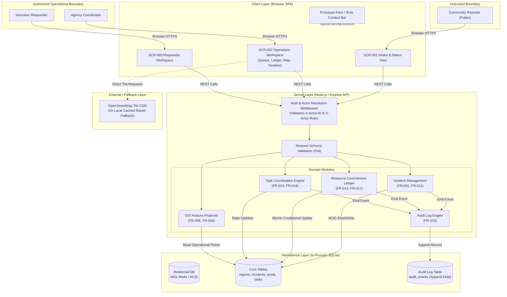
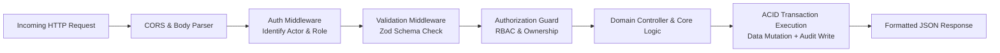
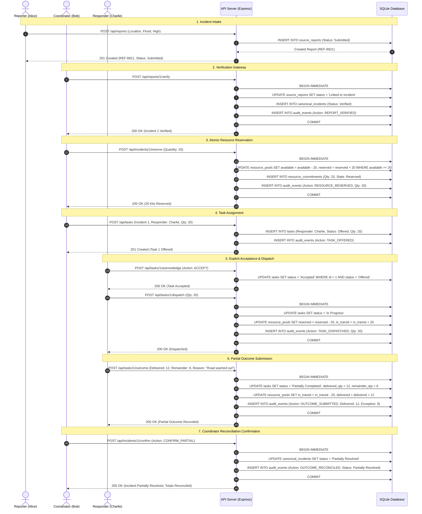
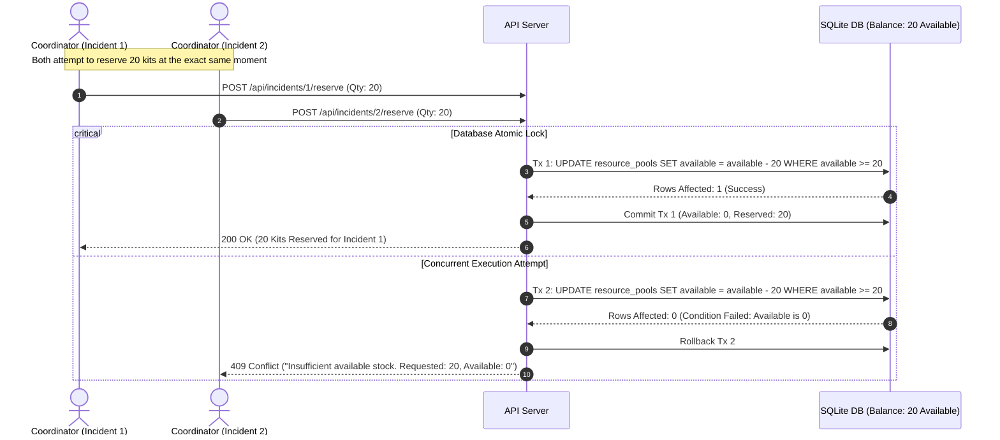
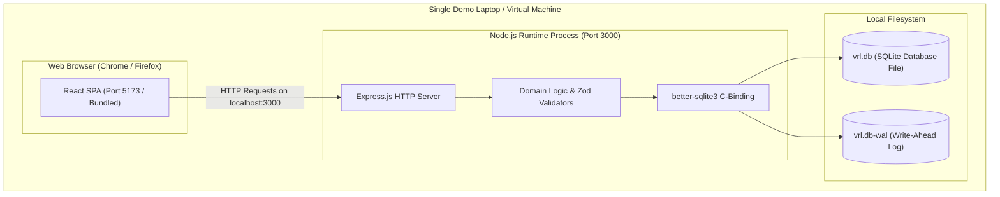

# Crisis Response Platform — System Architecture

**Document:** `docs/07-Technical_Design/01-Architecture.md`  
**System:** Verified Response Ledger (VRL)  
**Stage:** Step 7 — Technical Design  
**Date:** 20 September 2026  
**Status:** Frozen Technical Specification  

---

# 1. Architectural Drivers

Every major architectural choice in this system is derived directly from locked product requirements and risk guardrails:

| Driver | Related Requirement | Architectural Consequence |
|---|---|---|
| **Balance Conservation & Non-Negative Inventory** | FR-003, FR-014, FR-017, BR-004 | Requires an ACID relational persistence engine supporting atomic conditional updates or serialized write transactions. In-memory maps or non-transactional document stores are rejected. |
| **Deterministic Role Segregation** | FR-012, BR-006, PRD Section 14 | Requires a centralized server-side authorization pipeline. Role boundaries (Reporter vs. Coordinator vs. Responder) must be enforced at the API controller boundary, independent of UI presentation. |
| **Tamper-Evident History & Attribution** | FR-019, C-08, BR-010 | Requires an append-only relational audit table with strict foreign key linkage and no exposure of `UPDATE` or `DELETE` operations to any product role. |
| **Zero-Network Demo Resilience** | S-04, S-05, Scope Lock Section 13 | Requires zero mandatory external cloud service dependencies (no external identity provider, no cloud message queue, no paid tile server, zero AI APIs). Must execute locally on a single machine. |
| **Cross-View Operational Synchronization** | FR-008, FR-009, FR-020, C-09 | Queue, Ledger, Timeline, and Map views must query a single unified database. A simple polling mechanism (3s) ensures consistent state propagation without WebSocket failure risks. |
| **Explicit Ownership Transfer** | FR-015, C-05, BR-003 | Requires two-phase task assignment: task creation does not equal ownership. State must model `Offered` pending explicit acknowledgement before dispatch is unlocked. |
| **Zero AI Footprint** | Scope Lock Section 5, PRD Section 21, BR-025 | All logic must be deterministic and rule-based. Architecture contains zero model servers, vector indexes, prompt pipelines, or inference engines. |

---

# 2. Architecture Options Evaluation

We evaluated realistic architecture options against our specific hackathon requirements:

| Approach | Advantages | Risks | Fit for Verified Response Ledger |
|---|---|---|:---:|
| **Microservices (Docker Compose / K8s)** | Independent deployment of GIS, Auth, and Ledger services; technology flexibility. | High operational complexity; distributed transaction failures; inter-service latency; difficult local setup during a demo; potential network partition errors. | **Poor:** Directly violates hackathon simplicity rules; introduces distributed consistency problems for a single-resource ledger. |
| **Serverless (Next.js / Cloudflare Workers + D1 / Supabase)** | Fast initial scaffolding; managed database; serverless deployment. | Cold starts during live demonstration; connection pooling issues; cloud dependency requires internet connectivity during demo; vendor lock-in. | **Moderate:** Viable, but introduces external network risk and runtime overhead for simple local demonstrations. |
| **Client SPA + Single Node.js API Monolith + SQLite** | Single process; zero external daemons; sub-millisecond local latency; full ACID compliance; runs 100% offline; trivial debugging and state inspection. | Vertical scaling limits (irrelevant for prototype); requires manual migration to Postgres for multi-region enterprise production. | **Optimal (Selected):** Fully satisfies all P0 requirements, ensures 100% demo reliability, and encapsulates all domain logic in a clean modular monolith. |

---

# 3. Selected Architecture Overview

The Verified Response Ledger is built as a **Client SPA + Modular Node.js API Server** backed by an in-process **SQLite 3 ACID Relational Database**.

```
┌────────────────────────────────────────────────────────────────────────┐
│                          CLIENT APPLICATION                            │
│           React 19 + TypeScript + Vite + Leaflet GIS Engine            │
│  ┌────────────────────┐ ┌────────────────────┐ ┌────────────────────┐  │
│  │ SCR-001 (Reporter) │ │ SCR-002 (Coord.)   │ │ SCR-003 (Responder)│  │
│  └────────────────────┘ └────────────────────┘ └────────────────────┘  │
└───────────────────────────────────┬────────────────────────────────────┘
                                    │ HTTP / REST (JSON)
                                    ▼
┌────────────────────────────────────────────────────────────────────────┐
│                        API & APPLICATION SERVER                        │
│                   Node.js 22 LTS + Express.js + Zod                    │
│                                                                        │
│  ┌──────────────────────────────────────────────────────────────────┐  │
│  │           Security & Authentication / Authorization Gate         │  │
│  └──────────────────────────────────┬───────────────────────────────┘  │
│                                     ▼                                  │
│  ┌──────────────────────────────────────────────────────────────────┐  │
│  │                         Domain Modules                           │  │
│  │  ┌──────────────┐ ┌──────────────┐ ┌──────────────┐ ┌──────────┐ │  │
│  │  │   Incident   │ │   Resource   │ │     Task     │ │   GIS    │ │  │
│  │  │    Module    │ │    Ledger    │ │ Coordination │ │Projection│ │  │
│  │  └──────┬───────┘ └──────┬───────┘ └──────┬───────┘ └────┬─────┘ │  │
│  │         │                │                │              │       │  │
│  │         └────────────────┼────────────────┼──────────────┘       │  │
│  │                          ▼                ▼                      │  │
│  │                  ┌───────────────────────────────┐               │  │
│  │                  │      Audit Logging Engine     │               │  │
│  │                  └───────────────┬───────────────┘               │  │
│  └──────────────────────────────────┼───────────────────────────────┘  │
└─────────────────────────────────────┼──────────────────────────────────┘
                                      ▼
┌────────────────────────────────────────────────────────────────────────┐
│                         PERSISTENCE ENGINE                             │
│               SQLite 3 (WAL Mode, Strict Constraints)                  │
│  ┌────────────────────┐ ┌────────────────────┐ ┌────────────────────┐  │
│  │  source_reports    │ │ resource_pools     │ │ tasks              │  │
│  │  canonical_incid.  │ │ resource_commitm.  │ │ audit_events       │  │
│  └────────────────────┘ └────────────────────┘ └────────────────────┘  │
└────────────────────────────────────────────────────────────────────────┘
```

---

# 4. High-Level Architecture Diagram



---

# 5. Component Responsibilities

| Component | Responsibility | Inputs | Outputs | Related Requirements |
|---|---|---|---|---|
| **Client SPA (`frontend/`)** | Presents role-specific screens, manages form validation, renders interactive Leaflet map, executes 3s periodic polling. | User actions, HTTP API responses. | JSON HTTP requests, DOM updates. | SCR-001, SCR-002, SCR-003 |
| **Auth Middleware (`src/middleware/auth.ts`)** | Resolves request identity from headers (`X-Actor-ID`, `X-Actor-Role`); enforces RBAC matrix. | HTTP Request Headers. | Attached `req.actor` context or HTTP 401/403. | FR-012, PRD Section 14 |
| **Validation Filter (`src/middleware/validate.ts`)** | Validates incoming payloads against Zod schemas; rejects malformed inputs. | HTTP Request Body / Params. | Sanitized TypeScript DTO or HTTP 422. | FR-001, FR-014, PRD Section 16 |
| **Incident Module (`src/modules/incident/`)** | Ingests community reports, manages verification gateway, generates tracking references. | Validated report DTO, verify/reject commands. | Created report, canonical incident record. | FR-001, FR-002, FR-011 |
| **Resource Ledger (`src/modules/ledger/`)** | Enforces atomic resource allocation, non-negative balance invariants, and quantity reconciliation. | Reserve, dispatch, outcome, reconcile commands. | Commitment records, updated pool balance. | FR-003, FR-004, FR-014, FR-017 |
| **Task Module (`src/modules/task/`)** | Coordinates structured assignment, explicit responder acceptance, and dispatch updates. | Create task, accept, decline, dispatch payloads. | Task lifecycle states, execution timestamps. | FR-006, FR-007, FR-015, FR-016 |
| **GIS Projection (`src/modules/gis/`)** | Projects underlying incident and depot records into a GeoJSON FeatureCollection with live status. | Database read queries. | GeoJSON FeatureCollection. | FR-008, FR-009, C-09 |
| **Audit Engine (`src/modules/audit/`)** | Writes immutable audit events for all state-changing actions within the active transaction. | Domain event payload (actor, entity, delta). | Persisted audit record in `audit_events`. | FR-019, C-08, BR-010 |
| **Demo Controller (`src/modules/demo/`)** | Provides deterministic scenario reset and invariant validation for demo rehearsal. | Reset command. | Re-seeded database state, invariant pass/fail report. | FR-025, S-05 |

---

# 6. Module Boundaries

### Module 1: `AuthModule`
- **Responsibility:** Identity resolution, role verification, and access guard enforcement.
- **Owns:** User fixture definitions (`users` table), role-to-permission mapping table.
- **Does Not Own:** Incident verification or resource allocation logic.
- **Dependencies:** None.
- **Related FRs:** FR-012, BR-006.

### Module 2: `IncidentModule`
- **Responsibility:** Ingesting community reports, issuing reference codes, managing verification/rejection lifecycle.
- **Owns:** `source_reports`, `canonical_incidents`, `duplicate_links` tables.
- **Does Not Own:** Inventory pools or responder dispatch logic.
- **Dependencies:** `AuthModule`, `AuditEngine`.
- **Related FRs:** FR-001, FR-002, FR-005, FR-011, FR-021.

### Module 3: `ResourceLedgerModule`
- **Responsibility:** Managing countable emergency stock, atomic reservations, movement states, and quantity reconciliation.
- **Owns:** `resource_pools`, `resource_commitments` tables.
- **Does Not Own:** Task assignment or incident intake.
- **Dependencies:** `AuthModule`, `IncidentModule`, `AuditEngine`.
- **Related FRs:** FR-003, FR-004, FR-014, FR-017, FR-023.

### Module 4: `TaskCoordinationModule`
- **Responsibility:** Structured task creation, explicit acknowledgement handoff, dispatch progress, and outcome submission.
- **Owns:** `tasks`, `coordination_updates` tables.
- **Does Not Own:** Inventory pool calculations or incident creation.
- **Dependencies:** `AuthModule`, `IncidentModule`, `ResourceLedgerModule`, `AuditEngine`.
- **Related FRs:** FR-006, FR-007, FR-015, FR-016, FR-022.

### Module 5: `GISProjectionModule`
- **Responsibility:** Transforming persisted incidents and resource depots into standard GeoJSON features for map visualization.
- **Owns:** No persistent tables (stateless projection layer).
- **Does Not Own:** Business logic or state changes.
- **Dependencies:** `IncidentModule`, `ResourceLedgerModule`.
- **Related FRs:** FR-008, FR-009, C-09.

### Module 6: `AuditEngine`
- **Responsibility:** Persisting immutable audit event records.
- **Owns:** `audit_events` table.
- **Does Not Own:** Domain validation or business decisions.
- **Dependencies:** None (called by domain modules).
- **Related FRs:** FR-019, C-08, BR-010.

---

# 7. Frontend Architecture

### Routing Strategy
Client-side view switching based on active role context and URL path:
- `/` or `/report`: `SCR-001` (Reporter Intake & Status)
- `/coordinator`: `SCR-002` (Coordinator Workspace: Queue, Ledger, Map, Timeline)
- `/responder`: `SCR-003` (Responder Task Workspace)

### Screen & Module Organization
```
frontend/src/
├── components/
│   ├── common/         # Button, Modal, Badge, Toast, FormInputs
│   ├── gis/            # LeafletMap, MarkerLayer, Legend, FallbackList
│   ├── timeline/       # AuditTimelineCard, EventRow
│   └── ledger/         # InventoryBar, CommitmentTable
├── screens/
│   ├── SCR-001-Reporter/     # IntakeForm, ReferenceCard, LimitedStatusView
│   ├── SCR-002-Coordinator/  # ReportQueue, DetailDrawer, ReservationModal, TaskModal
│   └── SCR-003-Responder/    # TaskList, AcknowledgementBar, OutcomeForm
├── state/
│   ├── RoleContext.tsx       # Active identity (Alice/Bob/Charlie) & token injector
│   └── Store.ts              # Server-state polling hook & cache invalidation
└── styles/
    ├── tokens.css            # Dark-mode emergency palette, glassmorphism tokens
    └── main.css              # Responsive grid, reset, and base styles
```

### State Management & Synchronization
1. **Local UI State:** Form draft inputs, modal visibility, selected incident ID, map zoom level. Managed via standard React `useState`.
2. **Server State:** Incident queue, resource balance, active tasks, audit events, map features. Managed via a lightweight custom hook (`useServerData`) with automatic **3000ms periodic polling** and immediate **action-triggered re-fetching**.
3. **Authentication State:** Global React Context (`RoleContext`) tracking the currently selected demo actor (`alice`, `bob`, `charlie`). Injects `X-Actor-ID` and `X-Actor-Role` into every outgoing `fetch` request.
4. **Error Handling:** Standardized error toast component displaying structured API error payloads (`{ code, message, details }`). Form fields highlight directly on HTTP 422 responses.

---

# 8. Backend Architecture & Request Pipeline

Every incoming HTTP request passes through a strictly ordered pipeline before reaching domain business logic:



1. **Request Handling & Parsing:** Express router parses JSON bodies up to 100KB.
2. **Authentication Boundary:** Middleware inspects headers. If an invalid actor or role is supplied, rejects immediately with `401 Unauthorized`.
3. **Validation Boundary:** Validates request structure against predefined Zod schemas. If required fields are missing or out-of-range, rejects with `422 Unprocessable Entity` containing field-level error messages.
4. **Authorization Boundary:** Evaluates role against the PRD permission matrix. If an actor attempts an action outside their role (e.g., Reporter calling `/verify`), rejects with `403 Forbidden`.
5. **Business Logic & State Transition:** Domain module checks preconditions and current state. If a transition is illegal (e.g., reserving stock for an unverified report), rejects with `409 Conflict` or `422 Unprocessable Entity`.
6. **Persistence & Audit Transaction:** The database execution occurs inside an atomic transaction:
   ```sql
   BEGIN IMMEDIATE;
   -- 1. Apply state mutation
   -- 2. Decrement/Increment resource balance
   -- 3. Insert immutable audit event
   COMMIT;
   ```
7. **Response Formatting:** Returns standardized success JSON containing updated entity state and provenance metadata.

---

# 9. Critical Workflow Sequence Diagrams

### 9.1 The Critical Demo Journey (End-to-End Core Proof)



---

### 9.2 High-Risk Concurrency Race: Competing Resource Reservation

This diagram proves how our architecture handles simultaneous allocation requests without overcommitting inventory:



---

# 10. State Management

| State Category | Components | Storage / Source of Truth | Synchronization Mechanism |
|---|---|---|---|
| **Client State** | Form inputs, modal open/close, active tab, UI filter dropdowns. | React Component State (`useState`) in Browser Memory. | Ephemeral; discarded on route exit. |
| **Server State** | Operational report queue, incident records, active tasks, resource ledger. | Express Server memory query cache. | Sourced from SQLite database on each request. |
| **Persistent State** | Reports, incidents, commitments, tasks, audit history. | SQLite 3 Relational Database on Local Disk (`vrl.db`). | ACID Transactions with Write-Ahead Logging (`WAL`). |
| **Derived State** | GeoJSON map features, total resource balance reconciliation summary. | Dynamically computed via SQL aggregation queries. | Computed on demand per GET request. |
| **AI-Generated State** | **NONE** | **N/A** (AI is locked OUT per PRD BR-025). | No AI state exists in the system. |
| **Simulated State** | Opening inventory fixture (20 kits), synthetic user personas (Alice, Bob, Charlie). | Seed Migration File (`src/db/seed.ts`). | Restored via `POST /api/demo/reset`. |

---

# 11. Real-Time & Refresh Strategy

We evaluated 4 real-time synchronization mechanisms:

| Strategy | Feasibility | Demo Risk | Decision |
|---|---|---|:---:|
| **WebSockets (Socket.io / ws)** | Requires stateful server connections, heartbeat handling, reconnect logic, and connection drops during browser tab sleep. | High risk of silent disconnect during live judge evaluation. | Rejected |
| **Server-Sent Events (SSE)** | Unidirectional HTTP streaming; cleaner than WebSockets, but requires persistent HTTP connection management. | Medium risk of proxy/browser buffer delays. | Rejected |
| **Action-Triggered Refetch + 3s Polling** | Standard HTTP GET requests; stateless; failsafe; transparent cache invalidation on any user action. | Zero risk. If a request drops, the next 3s tick recovers state automatically. | **Selected** |

**Implementation Contract:**
- Every UI mutation (`POST`/`PUT`) immediately invalidates local query state and triggers an instant refetch.
- All operational screens (`SCR-002`, `SCR-003`) execute a background poll every `3000ms` when the document is visible (`document.visibilityState === 'visible'`).

---

# 12. File & Media Handling

Per PRD Section 15 and Scope Lock Section 13:
> "No media upload, voice input, external message address, payment data, free-text AI prompt, route request, or GPS stream is an authorized input."

**Architectural Decision:** Zero file or media upload handling is implemented.
- Community reports accept textual location descriptions and coordinate floats.
- This eliminates file system storage bloat, multipart form-data parsing, virus scanning overhead, and cloud bucket (S3) dependencies.

---

# 13. External Integrations

| Integration | Type | Purpose | Failure Impact | Technical Fallback |
|---|---|---|---|---|
| **OpenStreetMap Tile CDN** | Real (HTTP) | Fetches standard raster map background tiles (`{z}/{x}/{y}.png`). | Map background appears blank or gray if internet drops. | **S-04 Fallback:** Operational list view renders immediately. Bundled local fallback raster tiles or SVG grid ensure demo continuity. |
| **Synthetic Seed Fixture** | Simulated (Local) | Bootstraps 20 relief kits, 1 depot, 3 users, and 2 baseline reports. | Demo scenario cannot start from a known baseline. | Hardcoded JSON seed embedded in backend repository; zero external fetch. |
| **External SMS / Push** | Simulated | Task notifications and reporter receipt confirmations. | None (Simulated). | Notifications are rendered directly on-screen inside the web application workspace. |

---

# 14. Deployment Architecture

For maximum hackathon demo reliability, the application deploys as a **self-contained single-node system**:



- **Environment Configuration:** Managed via a single local `.env` file containing port number, database file path, and CORS origins.
- **Local Fallback:** In the event of network disruption, the entire application executes cleanly on `localhost` without internet connectivity.

---

# 15. Failure Boundaries & Recovery

| Component | Potential Failure | User Impact | Technical Recovery Behavior |
|---|---|---|---|
| **OSM Tile Server** | Network loss / tile timeout | Map displays gray background tiles; markers remain visible. | Map container displays toast: "Map tile feed unavailable. Switched to offline vector mode." Users can toggle the **Operational List Fallback** (FR-024). |
| **Database Lock Timeout** | High concurrent contention during reservation | Request hangs momentarily. | SQLite is configured with `PRAGMA busy_timeout = 5000;`. Retries for 5 seconds before returning clean HTTP 503 error. |
| **Invalid State Transition Attempt** | User double-clicks action button or out-of-order execution | Action cannot proceed. | State guard catches illegal transition, issues rollback, and returns HTTP 422 with explanation: "Task is already in Accepted state." |
| **Browser Crash / Refresh** | Judge accidentally refreshes browser tab | Screen resets to default view. | All state is persisted on disk in SQLite; refreshing reloads the exact operational state from the server within 100ms. |

---

# 16. Observability & Telemetry

Prototype observability focuses on auditability and rapid debugging rather than complex enterprise monitoring:
1. **Application Console Logs:** Structured JSON logs containing timestamp, HTTP method, route, status code, and execution duration in milliseconds.
2. **Database Audit Table (`audit_events`):** Every domain action writes an immutable record containing:
   - `id`: Auto-incrementing primary key.
   - `timestamp`: ISO-8601 UTC timestamp.
   - `actor_id`: User identifier.
   - `actor_role`: Operational role.
   - `action`: Controlled event name (`REPORT_SUBMITTED`, `RESOURCE_RESERVED`, etc.).
   - `entity_type`: Target entity name.
   - `entity_id`: Target entity ID.
   - `delta`: JSON representation of previous vs new state or quantity movements.
3. **Health & Invariant Probe (`GET /api/health`):** Verifies database connectivity and runs a live conservation-of-mass check on the resource ledger ($\text{Available} + \text{Reserved} + \text{InTransit} + \text{Delivered} = \text{Opening Balance}$).
