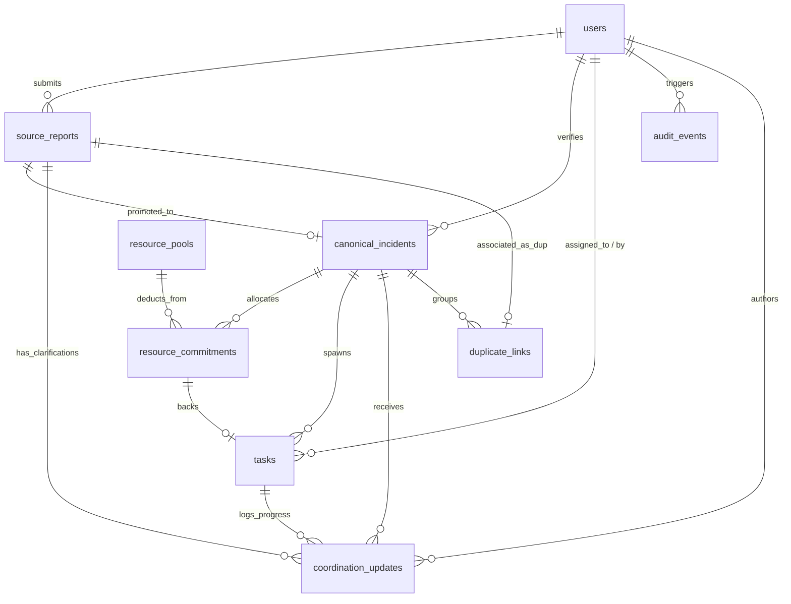

# Crisis Response Platform — Data Model Specification

**Document:** `docs/07-Technical_Design/02-Data_Model.md`  
**System:** Verified Response Ledger (VRL)  
**Stage:** Step 7 — Technical Design  
**Date:** 20 September 2026  
**Status:** Frozen Technical Specification  

---

# 1. Data Model Principles

The Verified Response Ledger data model is designed around five non-negotiable principles derived from the PRD and Scope Lock:

1. **Conservation of Mass (Zero Inventory Leakage):** The emergency resource pool balance must be mathematically closed. The sum of units across all lifecycle states must always equal the opening stock balance:
   $$\text{Quantity}_{\text{Available}} + \text{Quantity}_{\text{Reserved}} + \text{Quantity}_{\text{In-Transit}} + \text{Quantity}_{\text{Delivered}} = \text{Quantity}_{\text{Total}}$$
2. **Immutable Audit History (Tamper Resistance):** Historical operational decisions cannot be overwritten or deleted. State transitions produce append-only rows in `audit_events` and `coordination_updates`.
3. **Single Persistent Source of Truth:** Incidents, resources, and tasks share a unified relational schema. Projections (such as GeoJSON map markers or UI summary cards) are generated on-the-fly from authoritative tables rather than maintained as separate mutable stores.
4. **Database-Enforced Integrity:** Data sanity is enforced at the database engine level via strict `FOREIGN KEY`, `CHECK`, and `NOT NULL` constraints, rather than relying solely on client or application logic.
5. **Discrete Integer Precision:** Quantities are whole integer relief kits. Floating-point quantities and negative values are strictly prohibited by check constraints.

---

# 2. Conceptual to Technical Entity Mapping

| PRD Entity (PRD Section 19) | Technical Table Name | Storage Purpose | Related FRs |
|---|---|---|---|
| **Prototype User / Role Context** | `users` | Stores synthetic identity and operational role profiles. | FR-012 |
| **Source Report** | `source_reports` | Captures original unverified community submissions without mutation. | FR-001, FR-002 |
| **Canonical Incident** | `canonical_incidents` | Tracks authorized operational emergency incidents through resolution. | FR-011, FR-013 |
| **Resource Pool** | `resource_pools` | Maintains live inventory totals for countable relief kit depot pools. | FR-003, FR-014 |
| **Resource Commitment / Movement** | `resource_commitments` | Records individual quantity allocations and state transitions. | FR-004, FR-014, FR-017 |
| **Task** | `tasks` | Tracks assignment, acceptance, and execution ownership handoffs. | FR-006, FR-015, FR-016 |
| **Coordination Update** | `coordination_updates` | Stores structured instructions, clarifications, and progress notes. | FR-005, FR-007 |
| **Audit Event** | `audit_events` | Immutable log of all system transitions and quantity movements. | FR-019, C-08 |
| **(P1) Duplicate Link** | `duplicate_links` | Relates duplicate source reports to a single canonical incident. | FR-021 |

---

# 3. Detailed Entity Definitions & SQL Schemas

All schemas use concrete SQLite 3 / SQL DDL with strict types and check constraints.

### 3.1 Table: `users`
Represents prepared prototype personas (Alice Reporter, Bob Coordinator, Charlie Responder).

```sql
CREATE TABLE users (
    id TEXT PRIMARY KEY,                       -- e.g., 'alice', 'bob', 'charlie'
    display_name TEXT NOT NULL,                -- e.g., 'Alice (Community Reporter)'
    role TEXT NOT NULL CHECK (role IN ('REPORTER', 'COORDINATOR', 'RESPONDER')),
    contact_safe TEXT NOT NULL,                -- Synthetic demo contact info
    is_active INTEGER NOT NULL DEFAULT 1 CHECK (is_active IN (0, 1)),
    created_at TEXT NOT NULL DEFAULT (strftime('%Y-%m-%dT%H:%M:%SZ', 'now'))
);
```

---

### 3.2 Table: `source_reports`
Captures raw incident submissions from community reporters. Original rows are never updated except for their status pointer.

```sql
CREATE TABLE source_reports (
    id INTEGER PRIMARY KEY AUTOINCREMENT,
    reference_code TEXT NOT NULL UNIQUE,       -- e.g., 'REF-8921-X' (for public tracking)
    reporter_id TEXT NOT NULL,                 -- FK to users.id
    location_name TEXT NOT NULL,               -- e.g., 'Riverside Ward 4'
    latitude REAL NOT NULL CHECK (latitude BETWEEN -90.0 AND 90.0),
    longitude REAL NOT NULL CHECK (longitude BETWEEN -180.0 AND 180.0),
    incident_type TEXT NOT NULL CHECK (incident_type IN ('FLOOD', 'STRUCTURAL_DAMAGE', 'MEDICAL_EMERGENCY', 'ROAD_BLOCKAGE', 'SUPPLY_SHORTAGE')),
    reporter_severity TEXT NOT NULL CHECK (reporter_severity IN ('LOW', 'MEDIUM', 'HIGH', 'CRITICAL')),
    description TEXT NOT NULL CHECK (length(trim(description)) > 0 AND length(description) <= 1000),
    status TEXT NOT NULL DEFAULT 'SUBMITTED' CHECK (status IN ('SUBMITTED', 'LINKED_TO_INCIDENT', 'REJECTED')),
    rejection_reason TEXT,
    created_at TEXT NOT NULL DEFAULT (strftime('%Y-%m-%dT%H:%M:%SZ', 'now')),
    FOREIGN KEY (reporter_id) REFERENCES users (id) ON DELETE RESTRICT
);
```

---

### 3.3 Table: `canonical_incidents`
Represents verified operational emergencies governed by the Agency Coordinator.

```sql
CREATE TABLE canonical_incidents (
    id INTEGER PRIMARY KEY AUTOINCREMENT,
    primary_report_id INTEGER NOT NULL UNIQUE, -- FK to source_reports.id
    verified_by TEXT NOT NULL,                 -- FK to users.id (Coordinator)
    location_name TEXT NOT NULL,
    latitude REAL NOT NULL CHECK (latitude BETWEEN -90.0 AND 90.0),
    longitude REAL NOT NULL CHECK (longitude BETWEEN -180.0 AND 180.0),
    incident_type TEXT NOT NULL,
    priority TEXT NOT NULL CHECK (priority IN ('LOW', 'MEDIUM', 'HIGH', 'URGENT')),
    status TEXT NOT NULL DEFAULT 'VERIFIED' CHECK (status IN ('VERIFIED', 'RESPONSE_ACTIVE', 'PARTIALLY_RESOLVED', 'RESOLVED', 'CANCELLED')),
    verified_at TEXT NOT NULL DEFAULT (strftime('%Y-%m-%dT%H:%M:%SZ', 'now')),
    resolved_at TEXT,
    closure_notes TEXT,
    FOREIGN KEY (primary_report_id) REFERENCES source_reports (id) ON DELETE RESTRICT,
    FOREIGN KEY (verified_by) REFERENCES users (id) ON DELETE RESTRICT
);
```

---

### 3.4 Table: `resource_pools`
Maintains the countable relief kit inventory for the primary depot.

```sql
CREATE TABLE resource_pools (
    id INTEGER PRIMARY KEY AUTOINCREMENT,
    resource_name TEXT NOT NULL,               -- e.g., 'Emergency Relief Kit'
    depot_name TEXT NOT NULL,                  -- e.g., 'Central Civic Depot'
    unit TEXT NOT NULL DEFAULT 'KITS',
    latitude REAL NOT NULL,
    longitude REAL NOT NULL,
    total_quantity INTEGER NOT NULL CHECK (total_quantity >= 0),
    available_quantity INTEGER NOT NULL CHECK (available_quantity >= 0),
    reserved_quantity INTEGER NOT NULL DEFAULT 0 CHECK (reserved_quantity >= 0),
    in_transit_quantity INTEGER NOT NULL DEFAULT 0 CHECK (in_transit_quantity >= 0),
    delivered_quantity INTEGER NOT NULL DEFAULT 0 CHECK (delivered_quantity >= 0),
    provenance TEXT NOT NULL DEFAULT 'SYNTHETIC_FIXTURE',
    last_confirmed_at TEXT NOT NULL DEFAULT (strftime('%Y-%m-%dT%H:%M:%SZ', 'now')),
    -- Conservation of Mass Invariant
    CONSTRAINT chk_pool_conservation CHECK (
        available_quantity + reserved_quantity + in_transit_quantity + delivered_quantity = total_quantity
    )
);
```

---

### 3.5 Table: `resource_commitments`
Tracks individual allocations linked between an incident, a task, and the resource pool.

```sql
CREATE TABLE resource_commitments (
    id INTEGER PRIMARY KEY AUTOINCREMENT,
    pool_id INTEGER NOT NULL,                  -- FK to resource_pools.id
    incident_id INTEGER NOT NULL,              -- FK to canonical_incidents.id
    task_id INTEGER,                           -- FK to tasks.id (Nullable until task created)
    quantity INTEGER NOT NULL CHECK (quantity > 0),
    status TEXT NOT NULL DEFAULT 'RESERVED' CHECK (status IN ('RESERVED', 'IN_TRANSIT', 'DELIVERED', 'EXCEPTION_RETURNED', 'RELEASED')),
    committed_by TEXT NOT NULL,                -- FK to users.id
    created_at TEXT NOT NULL DEFAULT (strftime('%Y-%m-%dT%H:%M:%SZ', 'now')),
    updated_at TEXT NOT NULL DEFAULT (strftime('%Y-%m-%dT%H:%M:%SZ', 'now')),
    FOREIGN KEY (pool_id) REFERENCES resource_pools (id) ON DELETE RESTRICT,
    FOREIGN KEY (incident_id) REFERENCES canonical_incidents (id) ON DELETE RESTRICT,
    FOREIGN KEY (task_id) REFERENCES tasks (id) ON DELETE SET NULL,
    FOREIGN KEY (committed_by) REFERENCES users (id) ON DELETE RESTRICT
);
```

---

### 3.6 Table: `tasks`
Tracks operational task execution assigned to responders. Enforces two-phase acknowledgement.

```sql
CREATE TABLE tasks (
    id INTEGER PRIMARY KEY AUTOINCREMENT,
    incident_id INTEGER NOT NULL,              -- FK to canonical_incidents.id
    commitment_id INTEGER NOT NULL UNIQUE,     -- FK to resource_commitments.id
    assigned_to TEXT NOT NULL,                 -- FK to users.id (Responder)
    assigned_by TEXT NOT NULL,                 -- FK to users.id (Coordinator)
    instructions TEXT NOT NULL CHECK (length(trim(instructions)) > 0),
    assigned_quantity INTEGER NOT NULL CHECK (assigned_quantity > 0),
    delivered_quantity INTEGER NOT NULL DEFAULT 0 CHECK (delivered_quantity >= 0),
    remainder_quantity INTEGER NOT NULL DEFAULT 0 CHECK (remainder_quantity >= 0),
    status TEXT NOT NULL DEFAULT 'OFFERED' CHECK (status IN ('OFFERED', 'ACCEPTED', 'DECLINED', 'IN_PROGRESS', 'PARTIALLY_COMPLETED', 'COMPLETED', 'FAILED', 'CANCELLED')),
    exception_reason TEXT,
    offered_at TEXT NOT NULL DEFAULT (strftime('%Y-%m-%dT%H:%M:%SZ', 'now')),
    accepted_at TEXT,
    dispatched_at TEXT,
    completed_at TEXT,
    FOREIGN KEY (incident_id) REFERENCES canonical_incidents (id) ON DELETE RESTRICT,
    FOREIGN KEY (commitment_id) REFERENCES resource_commitments (id) ON DELETE RESTRICT,
    FOREIGN KEY (assigned_to) REFERENCES users (id) ON DELETE RESTRICT,
    FOREIGN KEY (assigned_by) REFERENCES users (id) ON DELETE RESTRICT,
    -- Outcome sanity: delivered + remainder cannot exceed assigned
    CONSTRAINT chk_task_quantities CHECK (delivered_quantity + remainder_quantity <= assigned_quantity)
);
```

---

### 3.7 Table: `coordination_updates`
Structured operational communication attached to reports, incidents, or tasks.

```sql
CREATE TABLE coordination_updates (
    id INTEGER PRIMARY KEY AUTOINCREMENT,
    report_id INTEGER,                         -- FK to source_reports.id
    incident_id INTEGER,                       -- FK to canonical_incidents.id
    task_id INTEGER,                           -- FK to tasks.id
    author_id TEXT NOT NULL,                   -- FK to users.id
    update_type TEXT NOT NULL CHECK (update_type IN ('CLARIFICATION', 'INSTRUCTION', 'PROGRESS', 'EXCEPTION', 'OUTCOME_NOTE')),
    message TEXT NOT NULL CHECK (length(trim(message)) > 0 AND length(message) <= 2000),
    created_at TEXT NOT NULL DEFAULT (strftime('%Y-%m-%dT%H:%M:%SZ', 'now')),
    FOREIGN KEY (report_id) REFERENCES source_reports (id) ON DELETE CASCADE,
    FOREIGN KEY (incident_id) REFERENCES canonical_incidents (id) ON DELETE CASCADE,
    FOREIGN KEY (task_id) REFERENCES tasks (id) ON DELETE CASCADE,
    FOREIGN KEY (author_id) REFERENCES users (id) ON DELETE RESTRICT
);
```

---

### 3.8 Table: `audit_events`
Immutable event log for all state-changing operational actions.

```sql
CREATE TABLE audit_events (
    id INTEGER PRIMARY KEY AUTOINCREMENT,
    timestamp TEXT NOT NULL DEFAULT (strftime('%Y-%m-%dT%H:%M:%SZ', 'now')),
    actor_id TEXT NOT NULL,
    actor_role TEXT NOT NULL,
    action TEXT NOT NULL,                      -- e.g., 'REPORT_SUBMITTED', 'RESOURCE_RESERVED'
    entity_type TEXT NOT NULL,                -- e.g., 'INCIDENT', 'RESOURCE_POOL', 'TASK'
    entity_id TEXT NOT NULL,                  -- Target ID
    before_state TEXT,                        -- JSON representation of previous state
    after_state TEXT,                         -- JSON representation of new state
    quantity_delta INTEGER DEFAULT 0,         -- Positive/negative movement
    reason TEXT,                              -- User or system provided rationale
    FOREIGN KEY (actor_id) REFERENCES users (id) ON DELETE RESTRICT
);
```

---

### 3.9 Table: `duplicate_links` (P1 Capability)
Maintains reversible associations between duplicate source reports and a single canonical incident.

```sql
CREATE TABLE duplicate_links (
    id INTEGER PRIMARY KEY AUTOINCREMENT,
    canonical_incident_id INTEGER NOT NULL,
    duplicate_report_id INTEGER NOT NULL UNIQUE,
    linked_by TEXT NOT NULL,
    link_reason TEXT NOT NULL,
    linked_at TEXT NOT NULL DEFAULT (strftime('%Y-%m-%dT%H:%M:%SZ', 'now')),
    is_active INTEGER NOT NULL DEFAULT 1 CHECK (is_active IN (0, 1)),
    FOREIGN KEY (canonical_incident_id) REFERENCES canonical_incidents (id) ON DELETE CASCADE,
    FOREIGN KEY (duplicate_report_id) REFERENCES source_reports (id) ON DELETE RESTRICT,
    FOREIGN KEY (linked_by) REFERENCES users (id) ON DELETE RESTRICT
);
```

---

# 4. Entity-Relationship Diagram



---

# 5. State Representation & Lifecycle Rules

### 5.1 Source Report Lifecycle
- **Initial:** `SUBMITTED`
- **Valid Transitions:**
  - `SUBMITTED` $\rightarrow$ `LINKED_TO_INCIDENT` (Coordinator verifies)
  - `SUBMITTED` $\rightarrow$ `REJECTED` (Coordinator rejects with reason)
- **Forbidden:** No return to `SUBMITTED`. Rejection cannot be undone without formal re-submission.

### 5.2 Canonical Incident Lifecycle
- **Initial:** `VERIFIED`
- **Valid Transitions:**
  - `VERIFIED` $\rightarrow$ `RESPONSE_ACTIVE` (Resource reserved & task created)
  - `RESPONSE_ACTIVE` $\rightarrow$ `PARTIALLY_RESOLVED` (Partial delivery confirmed; remainder logged)
  - `RESPONSE_ACTIVE` $\rightarrow$ `RESOLVED` (Full delivery confirmed)
  - `PARTIALLY_RESOLVED` $\rightarrow$ `RESOLVED` (Remaining tasks completed)
  - `VERIFIED` / `RESPONSE_ACTIVE` $\rightarrow$ `CANCELLED` (Incident revoked; stock released)

### 5.3 Resource Pool Quantity States
Units within the countable pool move strictly across discrete buckets:
$$\text{Available} \xrightarrow{\text{Reserve}} \text{Reserved} \xrightarrow{\text{Dispatch}} \text{In-Transit} \xrightarrow{\text{Deliver}} \text{Delivered}$$
$$\text{In-Transit} \xrightarrow{\text{Exception}} \text{Exception/Returned} \xrightarrow{\text{Reconcile}} \text{Available (Released)}$$

### 5.4 Task Lifecycle
- **Initial:** `OFFERED`
- **Valid Transitions:**
  - `OFFERED` $\rightarrow$ `ACCEPTED` (Assigned responder explicitly clicks Accept)
  - `OFFERED` $\rightarrow$ `DECLINED` (Assigned responder explicitly declines)
  - `ACCEPTED` $\rightarrow$ `IN_PROGRESS` (Responder marks dispatched)
  - `IN_PROGRESS` $\rightarrow$ `COMPLETED` (Delivered quantity = assigned quantity)
  - `IN_PROGRESS` $\rightarrow$ `PARTIALLY_COMPLETED` (Delivered < assigned; exception note required)
  - `IN_PROGRESS` $\rightarrow$ `FAILED` (Zero delivered; mission aborted with reason)

---

# 6. Data Integrity & Business Rule Enforcement

| Business Rule | Application Layer Enforcement | Database Layer Enforcement |
|---|---|---|
| **Non-Negative Stock** (BR-004) | Controller verifies requested qty $\le$ available balance. | SQLite `CHECK (available_quantity >= 0)` constraint aborts transaction if negative. |
| **Balance Conservation** | Module updates pool available and reserved balances in tandem. | SQLite `CHECK (available + reserved + in_transit + delivered = total)` constraint. |
| **Task Acknowledgement** (BR-003) | `dispatch` endpoint checks `task.status === 'ACCEPTED'`. | State machine validation blocks dispatch transitions from `OFFERED`. |
| **Immutable History** (BR-010) | No `UPDATE` or `DELETE` endpoints exposed for audit records. | Database trigger or application query whitelist prevents mutation. |
| **Reconciled Closure** (BR-009) | Coordinator confirmation verifies delivered + remainder = assigned. | SQLite `CHECK (delivered_quantity + remainder_quantity <= assigned_quantity)`. |
| **Valid Coordinate Bounds** | Zod schema checks lat $[-90, 90]$ and long $[-180, 180]$. | SQLite `CHECK (latitude BETWEEN -90.0 AND 90.0)` constraint. |

---

# 7. Concurrency Strategy & Row Locking

### Race Condition: Competing Over-Reservation
- **Scenario:** Two coordinators attempt to reserve 20 kits simultaneously from an available pool balance of 20 kits.
- **Protection Mechanism:** Atomic Conditional SQL Update.
  ```sql
  UPDATE resource_pools
  SET available_quantity = available_quantity - :requested_qty,
      reserved_quantity = reserved_quantity + :requested_qty
  WHERE id = :pool_id AND available_quantity >= :requested_qty;
  ```
- **Execution Consequence:**
  - Request 1: Finds `available_quantity = 20 >= 20`. Rows affected = 1. Commits. Available becomes 0.
  - Request 2: Executes immediately afterward. Finds `available_quantity = 0 >= 20` (False). Rows affected = 0.
  - The application detects `rowsAffected === 0`, issues an automatic rollback, and returns `HTTP 409 Conflict` with message: *"Resource allocation conflict: insufficient stock available."*

---

# 8. Indexing Strategy

Only queries critical to operational performance and constraint enforcement are indexed:

```sql
-- Fast lookup for public reporter tracking status
CREATE INDEX idx_reports_ref ON source_reports (reference_code);

-- Rapid queue filtering by status for Coordinator dashboard
CREATE INDEX idx_reports_status ON source_reports (status);
CREATE INDEX idx_incidents_status ON canonical_incidents (status);

-- Rapid lookup of active tasks by assigned responder
CREATE INDEX idx_tasks_assigned_to ON tasks (assigned_to, status);

-- Audit query sorting by time
CREATE INDEX idx_audit_timestamp ON audit_events (timestamp DESC);
```

---

# 9. Synthetic Seed & Demo Baseline Fixture

The application includes a deterministic seed file (`src/db/seed.ts`) marked explicitly as **SYNTHETIC DEMO DATA**:

```json
{
  "users": [
    { "id": "alice", "display_name": "Alice (Community Reporter)", "role": "REPORTER" },
    { "id": "bob", "display_name": "Bob (Agency Coordinator)", "role": "COORDINATOR" },
    { "id": "charlie", "display_name": "Charlie (Field Volunteer)", "role": "RESPONDER" }
  ],
  "resource_pools": [
    {
      "id": 1,
      "resource_name": "Emergency Relief Kit",
      "depot_name": "Central Ward Depot",
      "total_quantity": 20,
      "available_quantity": 20,
      "reserved_quantity": 0,
      "in_transit_quantity": 0,
      "delivered_quantity": 0,
      "latitude": 19.0760,
      "longitude": 72.8777,
      "provenance": "SYNTHETIC_DEMO_DATA"
    }
  ]
}
```

---

# 10. Data Retention & Deletion Policy

- **Prototype Behavior:** Zero hard deletions. Completed or cancelled incidents, declined tasks, and rejected reports remain stored permanently in the local database to guarantee a complete audit trail during demonstrations.
- **Demo Reset:** Executing `POST /api/demo/reset` wipes and re-instantiates the clean 20-kit synthetic baseline in under 50 milliseconds.
- **Production Evolution:** Automated archival of resolved incidents to cold parquet/S3 storage after 180 days, compliant with disaster relief data governance standards.
