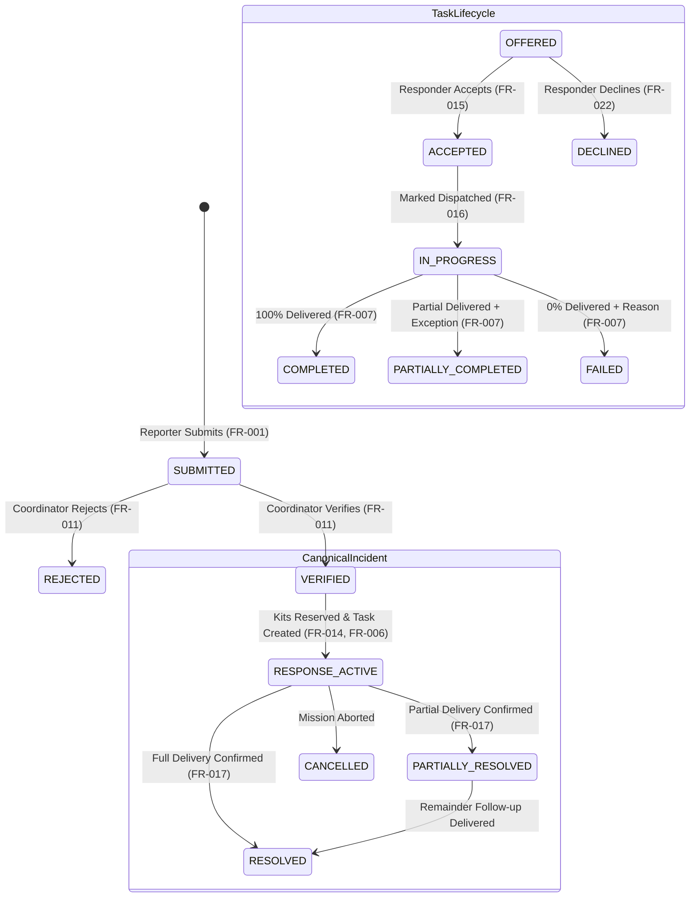

# Crisis Response Platform — Core Logic Specification

**Document:** `docs/07-Technical_Design/04-Core_Logic.md`  
**System:** Verified Response Ledger (VRL)  
**Stage:** Step 7 — Technical Design  
**Date:** 20 September 2026  
**Status:** Frozen Technical Specification  

---

# 1. Core Logic Inventory

The business logic of the Verified Response Ledger elevates the platform beyond basic CRUD operations by enforcing mathematical consistency, deterministic role governance, and state machine integrity.

| Logic ID | Mechanism | Requirement | Why Non-Trivial |
|---|---|---|---|
| **LOGIC-001** | Incident Verification & Canonical Promotion | FR-011, BR-001 | Translates unverified public observations into accountable operational incidents, decoupling public intake from resource commitment authority. |
| **LOGIC-002** | Atomic Resource Reservation & Shortage Protection | FR-014, BR-004, C-04 | Enforces conservation-of-mass and non-negative inventory balances under simultaneous competing allocation requests. |
| **LOGIC-003** | Two-Phase Assignment & Explicit Ownership Handover | FR-015, BR-003, C-05 | Guarantees that task assignment does not equal task ownership until explicit responder acknowledgement occurs. |
| **LOGIC-004** | Execution Outcome & Quantity Reconciliation | FR-017, BR-009, C-06 | Eliminates cosmetic status inflation; ensures delivered units plus explicit exception remainders exactly balance dispatched stock. |
| **LOGIC-005** | State Machine Lifecycle Transition Guard | FR-013, BR-007 | Rejects out-of-order, unauthorized, or mathematically impossible lifecycle state transitions across all entities. |
| **LOGIC-006** | GIS GeoJSON Projection Engine | FR-008, FR-009, C-09 | Dynamically projects relational database records into standard GeoJSON features with real-time operational status styling. |
| **LOGIC-007** | Immutable Audit Trail Generation | FR-019, BR-010, C-08 | Emits transactional, tamper-evident audit records capturing actor, timestamp, entity delta, and rationale for all mutations. |
| **LOGIC-008** | Deterministic Duplicate Report Detection (P1) | FR-021, S-01 | Evaluates proximity radius (500m) and temporal window (2 hours) using pure spatial math to propose human-reviewed linkages. |

---

# 2. Detailed Logic Specifications

---

### LOGIC-001 — Incident Verification & Canonical Promotion

- **Purpose:** Converts an unverified `source_reports` entry into a governed `canonical_incidents` record.
- **Related FR / BR:** FR-011, BR-001, BR-002.
- **Inputs:** `report_id: number`, `priority: string`, `coordinator_id: string`, `notes: string`.
- **Preconditions:**
  1. `report.status === 'SUBMITTED'`.
  2. Actor has `role === 'COORDINATOR'`.
- **Processing Steps & Pseudocode:**
  ```typescript
  function verifyReport(reportId: number, priority: Priority, coordinatorId: string, notes: string): CanonicalIncident {
      return db.transaction(() => {
          // 1. Fetch source report with row lock
          const report = db.prepare("SELECT * FROM source_reports WHERE id = ?").get(reportId);
          if (!report) throw new NotFoundError("Source report not found");
          if (report.status !== 'SUBMITTED') {
              throw new ConflictError(`Report cannot be verified from status: ${report.status}`);
          }

          // 2. Mark report as linked
          db.prepare("UPDATE source_reports SET status = 'LINKED_TO_INCIDENT' WHERE id = ?").run(reportId);

          // 3. Insert canonical incident
          const incidentResult = db.prepare(`
              INSERT INTO canonical_incidents (
                  primary_report_id, verified_by, location_name, latitude, longitude,
                  incident_type, priority, status, verified_at
              ) VALUES (?, ?, ?, ?, ?, ?, ?, 'VERIFIED', CURRENT_TIMESTAMP)
          `).run(report.id, coordinatorId, report.location_name, report.latitude, report.longitude, report.incident_type, priority);

          const incidentId = incidentResult.lastInsertRowid;

          // 4. Record audit event
          auditEngine.log({
              actorId: coordinatorId,
              actorRole: 'COORDINATOR',
              action: 'REPORT_VERIFIED',
              entityType: 'INCIDENT',
              entityId: incidentId.toString(),
              delta: { previousStatus: 'SUBMITTED', newStatus: 'VERIFIED', priority },
              reason: notes
          });

          return db.prepare("SELECT * FROM canonical_incidents WHERE id = ?").get(incidentId);
      })();
  }
  ```
- **Output:** Created `canonical_incidents` record.
- **State Changes:** `source_reports.status` $\rightarrow$ `LINKED_TO_INCIDENT`; new `canonical_incidents` in `VERIFIED` state.

---

### LOGIC-002 — Atomic Resource Reservation & Shortage Protection

- **Purpose:** Atomically commits relief kits from an available pool to an incident without risking over-allocation.
- **Related FR / BR:** FR-014, BR-004, C-04.
- **Inputs:** `incident_id: number`, `pool_id: number`, `quantity: number`, `coordinator_id: string`.
- **Preconditions:**
  1. `incident.status` is `VERIFIED` or `RESPONSE_ACTIVE`.
  2. `quantity > 0` and is an integer.
  3. `pool.available_quantity >= quantity`.
- **Processing Steps & Pseudocode:**
  ```typescript
  function reserveResources(incidentId: number, poolId: number, quantity: number, coordinatorId: string) {
      if (!Number.isInteger(quantity) || quantity <= 0) {
          throw new ValidationError("Reservation quantity must be a positive integer.");
      }

      return db.transaction(() => {
          // 1. Verify incident state
          const incident = db.prepare("SELECT * FROM canonical_incidents WHERE id = ?").get(incidentId);
          if (!incident) throw new NotFoundError("Incident not found.");
          if (!['VERIFIED', 'RESPONSE_ACTIVE'].includes(incident.status)) {
              throw new ConflictError(`Cannot reserve stock for incident in status: ${incident.status}`);
          }

          // 2. Execute Atomic Conditional Update on Resource Pool
          const updateResult = db.prepare(`
              UPDATE resource_pools
              SET available_quantity = available_quantity - ?,
                  reserved_quantity = reserved_quantity + ?
              WHERE id = ? AND available_quantity >= ?
          `).run(quantity, quantity, poolId, quantity);

          // 3. Concurrency check: If 0 rows updated, stock was exhausted by a competing transaction
          if (updateResult.changes === 0) {
              const currentPool = db.prepare("SELECT available_quantity FROM resource_pools WHERE id = ?").get(poolId);
              throw new ConcurrencyConflictError(
                  `Insufficient available stock. Requested: ${quantity}, Available: ${currentPool ? currentPool.available_quantity : 0}`
              );
          }

          // 4. Create resource commitment record
          const commitmentResult = db.prepare(`
              INSERT INTO resource_commitments (pool_id, incident_id, quantity, status, committed_by)
              VALUES (?, ?, ?, 'RESERVED', ?)
          `).run(poolId, incidentId, quantity, coordinatorId);

          const commitmentId = commitmentResult.lastInsertRowid;

          // 5. Update incident status to RESPONSE_ACTIVE if previously VERIFIED
          if (incident.status === 'VERIFIED') {
              db.prepare("UPDATE canonical_incidents SET status = 'RESPONSE_ACTIVE' WHERE id = ?").run(incidentId);
          }

          // 6. Log immutable audit trail
          auditEngine.log({
              actorId: coordinatorId,
              actorRole: 'COORDINATOR',
              action: 'RESOURCE_RESERVED',
              entityType: 'RESOURCE_POOL',
              entityId: poolId.toString(),
              delta: { quantityDelta: quantity, commitmentId, incidentId },
              reason: `Reserved ${quantity} relief kits for incident #${incidentId}`
          });

          return { commitmentId, reservedQuantity: quantity };
      })();
  }
  ```
- **Consequence of Race Condition:** Handled deterministically; loser receives `409 Conflict`. Invariant $\sum \text{quantities} = \text{total}$ is strictly preserved.

---

### LOGIC-003 — Two-Phase Task Assignment & Explicit Ownership Handover

- **Purpose:** Enforces that assigning a task only places it in an `OFFERED` state. The assigned responder must actively submit an acknowledgement before dispatch is allowed.
- **Related FR / BR:** FR-015, BR-003, C-05.
- **Inputs:** `task_id: number`, `action: 'ACCEPT' | 'DECLINE'`, `responder_id: string`.
- **Preconditions:**
  1. `task.status === 'OFFERED'`.
  2. `task.assigned_to === responder_id`.
- **Processing Steps & Pseudocode:**
  ```typescript
  function acknowledgeTask(taskId: number, action: 'ACCEPT' | 'DECLINE', responderId: string) {
      return db.transaction(() => {
          const task = db.prepare("SELECT * FROM tasks WHERE id = ?").get(taskId);
          if (!task) throw new NotFoundError("Task not found.");
          if (task.status !== 'OFFERED') {
              throw new ConflictError(`Task is not in OFFERED state. Current state: ${task.status}`);
          }
          if (task.assigned_to !== responderId) {
              throw new ForbiddenError("You are not the designated responder for this task.");
          }

          if (action === 'ACCEPT') {
              db.prepare(`
                  UPDATE tasks 
                  SET status = 'ACCEPTED', accepted_at = CURRENT_TIMESTAMP 
                  WHERE id = ?
              `).run(taskId);

              auditEngine.log({
                  actorId: responderId,
                  actorRole: 'RESPONDER',
                  action: 'TASK_ACCEPTED',
                  entityType: 'TASK',
                  entityId: taskId.toString(),
                  delta: { previousStatus: 'OFFERED', newStatus: 'ACCEPTED' },
                  reason: 'Responder explicitly accepted task ownership.'
              });

              return { status: 'ACCEPTED', message: 'Ownership confirmed.' };
          } else {
              // DECLINE flow (P1 S-02)
              db.prepare(`
                  UPDATE tasks 
                  SET status = 'DECLINED' 
                  WHERE id = ?
              `).run(taskId);

              auditEngine.log({
                  actorId: responderId,
                  actorRole: 'RESPONDER',
                  action: 'TASK_DECLINED',
                  entityType: 'TASK',
                  entityId: taskId.toString(),
                  delta: { previousStatus: 'OFFERED', newStatus: 'DECLINED' },
                  reason: 'Responder declined task assignment.'
              });

              return { status: 'DECLINED', message: 'Task declined. Re-queued for coordinator assignment.' };
          }
      })();
  }
  ```

---

### LOGIC-004 — Execution Outcome & Quantity Reconciliation Engine

- **Purpose:** Reconciles physical execution with operational ledgers. Verifies that delivered kits plus exception remainders equal the dispatched quantity.
- **Related FR / BR:** FR-017, BR-009, C-06.
- **Inputs:** `task_id: number`, `outcome_type: 'FULL' | 'PARTIAL' | 'FAILED'`, `delivered_qty: number`, `remainder_qty: number`, `exception_reason: string`, `responder_id: string`.
- **Preconditions:**
  1. `task.status === 'IN_PROGRESS'`.
  2. `delivered_qty + remainder_qty === task.assigned_quantity`.
  3. If `outcome_type !== 'FULL'`, `exception_reason` must be non-empty.
- **Processing Steps & Pseudocode:**
  ```typescript
  function submitTaskOutcome(
      taskId: number,
      outcomeType: 'FULL' | 'PARTIAL' | 'FAILED',
      deliveredQty: number,
      remainderQty: number,
      exceptionReason: string,
      responderId: string
  ) {
      return db.transaction(() => {
          const task = db.prepare("SELECT * FROM tasks WHERE id = ?").get(taskId);
          if (!task) throw new NotFoundError("Task not found.");
          if (task.status !== 'IN_PROGRESS') {
              throw new ConflictError("Task must be IN_PROGRESS to submit outcome.");
          }
          if (task.assigned_to !== responderId) {
              throw new ForbiddenError("Only the assigned responder can report an outcome.");
          }

          // Mathematical Invariant Check
          if (deliveredQty + remainderQty !== task.assigned_quantity) {
              throw new ValidationError(
                  `Quantity mismatch: delivered (${deliveredQty}) + remainder (${remainderQty}) != assigned (${task.assigned_quantity})`
              );
          }

          if (outcomeType !== 'FULL' && (!exceptionReason || exceptionReason.trim().length === 0)) {
              throw new ValidationError("Exception reason is strictly mandatory when outcome is partial or failed.");
          }

          let nextTaskStatus = 'COMPLETED';
          if (outcomeType === 'PARTIAL') nextTaskStatus = 'PARTIALLY_COMPLETED';
          if (outcomeType === 'FAILED') nextTaskStatus = 'FAILED';

          // 1. Update Task Record
          db.prepare(`
              UPDATE tasks
              SET status = ?,
                  delivered_quantity = ?,
                  remainder_quantity = ?,
                  exception_reason = ?,
                  completed_at = CURRENT_TIMESTAMP
              WHERE id = ?
          `).run(nextTaskStatus, deliveredQty, remainderQty, exceptionReason, taskId);

          // 2. Update Resource Pool Balances
          // Move delivered units from in_transit to delivered.
          // Note: The remainder remains accounted for until Coordinator confirmation.
          db.prepare(`
              UPDATE resource_pools
              SET in_transit_quantity = in_transit_quantity - ?,
                  delivered_quantity = delivered_quantity + ?
              WHERE id = (SELECT pool_id FROM resource_commitments WHERE id = ?)
          `).run(task.assigned_quantity, deliveredQty, task.commitment_id);

          // 3. Update Resource Commitment Record
          db.prepare(`
              UPDATE resource_commitments
              SET status = ?
              WHERE id = ?
          `).run(outcomeType === 'FULL' ? 'DELIVERED' : 'EXCEPTION_RETURNED', task.commitment_id);

          // 4. Log Immutable Audit Record
          auditEngine.log({
              actorId: responderId,
              actorRole: 'RESPONDER',
              action: 'OUTCOME_SUBMITTED',
              entityType: 'TASK',
              entityId: taskId.toString(),
              delta: {
                  deliveredQuantity: deliveredQty,
                  remainderQuantity: remainderQty,
                  outcomeType
              },
              reason: exceptionReason || 'Task executed successfully in full.'
          });

          return { taskId, status: nextTaskStatus, deliveredQty, remainderQty };
      })();
  }
  ```

---

# 3. Business Rule Enforcement Matrix

| Rule ID | Statement | Technical Enforcement | Layer | Failure Result |
|---|---|---|:---:|---|
| **BR-001** | Report $\neq$ Verified Incident | Verification requires explicit Coordinator POST action; intake creates only `source_reports`. | Controller & DB | Reports cannot be reserved or dispatched. |
| **BR-002** | Rejection is terminal | `POST /api/reports/:id/reject` sets status to `REJECTED`; rejected reports cannot be verified. | LOGIC-001 | HTTP 409 Conflict if verification attempted. |
| **BR-003** | Task assignment $\neq$ Ownership | Task initializes in `OFFERED`; dispatch action requires `ACCEPTED` status. | LOGIC-003 | HTTP 422 Unprocessable Entity on premature dispatch. |
| **BR-004** | Available $\ge$ 0 at all times | Atomic SQL conditional update `WHERE available >= ?` and DB `CHECK (available >= 0)`. | Database Engine | HTTP 409 Conflict on stock shortage. |
| **BR-006** | Server-side role authorization | Middleware inspects role; rejects unauthorized callers before business controllers run. | Express Middleware | HTTP 403 Forbidden. |
| **BR-007** | Valid state machine transitions | LOGIC-005 checks valid previous status before executing any update. | Domain Logic | HTTP 422 Unprocessable Entity. |
| **BR-009** | Reconciled closure | Check `delivered + remainder === assigned`; partial delivery forbids marking incident fully resolved. | LOGIC-004 & DB | HTTP 422 Unprocessable Entity. |
| **BR-010** | Immutable audit records | Zero `UPDATE` or `DELETE` SQL queries exist for `audit_events`. Table permissions block modification. | Persistence Engine | System guarantees append-only audit trail. |
| **BR-025** | Zero AI execution | Strictly deterministic algorithms; zero external inference calls or heuristic models. | Architecture | Eliminates non-deterministic hallucination risk. |

---

# 4. State Transition Enforcement Graph



---

# 5. Transaction Boundaries

All multi-step operations execute inside strict ACID transactions. Partial failures trigger automatic rollback, leaving database state completely clean:

### Boundary 1: Report Verification
```
BEGIN IMMEDIATE;
  1. UPDATE source_reports SET status = 'LINKED_TO_INCIDENT' WHERE id = :id AND status = 'SUBMITTED';
  2. INSERT INTO canonical_incidents (...);
  3. INSERT INTO audit_events (action = 'REPORT_VERIFIED', ...);
COMMIT;
```

### Boundary 2: Atomic Resource Reservation
```
BEGIN IMMEDIATE;
  1. UPDATE resource_pools SET available = available - :qty, reserved = reserved + :qty 
     WHERE id = :pool_id AND available >= :qty;
  -- If rows_affected == 0: ROLLBACK; return HTTP 409;
  2. INSERT INTO resource_commitments (pool_id, incident_id, quantity, status = 'RESERVED');
  3. UPDATE canonical_incidents SET status = 'RESPONSE_ACTIVE' WHERE id = :incident_id;
  4. INSERT INTO audit_events (action = 'RESOURCE_RESERVED', ...);
COMMIT;
```

### Boundary 3: Partial Outcome Reconciliation
```
BEGIN IMMEDIATE;
  1. UPDATE tasks SET status = 'PARTIALLY_COMPLETED', delivered_quantity = :deliv, remainder_quantity = :rem, exception_reason = :reason WHERE id = :task_id;
  2. UPDATE resource_pools SET in_transit = in_transit - :assigned, delivered = delivered + :deliv WHERE id = :pool_id;
  3. UPDATE resource_commitments SET status = 'EXCEPTION_RETURNED' WHERE id = :commitment_id;
  4. UPDATE canonical_incidents SET status = 'PARTIALLY_RESOLVED' WHERE id = :incident_id;
  5. INSERT INTO audit_events (action = 'OUTCOME_RECONCILED', ...);
COMMIT;
```

---

# 6. Concurrency Strategy & Race Condition Protection

| Critical Operation | Concurrency Race Condition | Potential Corrupt Outcome | Technical Protection Mechanism | Recovery Behavior |
|---|---|---|---|---|
| **Resource Reservation** | Two coordinators reserve 20 kits simultaneously when only 20 are available. | Pool balance becomes negative (-20 kits) or 40 kits are promised. | Single atomic SQL statement with precondition: `UPDATE ... WHERE available >= :qty`. | Winning transaction commits; losing transaction updates 0 rows, rolls back, and returns `HTTP 409 Conflict`. |
| **Task Acceptance** | Two responders attempt to accept the same task. | Split ownership of mission. | Conditional check: `UPDATE tasks SET status = 'ACCEPTED' WHERE id = :id AND status = 'OFFERED'`. | First request sets status to `ACCEPTED`; second request matches 0 rows and returns `HTTP 409 Conflict`. |
| **Double Outcome Submission** | Responder clicks "Submit Outcome" button twice in rapid succession. | Duplicate delivery quantities credited to inventory pool. | Task state guard checks `status === 'IN_PROGRESS'`. Second request finds status `PARTIALLY_COMPLETED` and rejects. | Second request returns `HTTP 409 Conflict`; pool balance remains untainted. |

---

# 7. Idempotency & Duplicate Protection

- **Reporter Form Intake:** Frontend generates a client-side UUID `Client-Request-Token`. If a user mashes the submit button, the backend checks if a report with that token was created within the last 60 seconds and returns the existing receipt without creating duplicate rows.
- **Task Dispatch & Outcome:** Guarded by current state assertions. If `status !== 'ACCEPTED'`, dispatch calls fail safely.

---

# 8. Core Logic Test Vectors

| Test ID | Mechanism | Test Vector Input | Expected Behavior & Assertions |
|---|---|---|---|
| **VEC-001** | Atomic Reservation | Pool Available: 20. Request: 20 kits. | Success (200 OK). Available: 0, Reserved: 20. Total: 20. |
| **VEC-002** | Shortage Protection | Pool Available: 0. Request: 5 kits. | Failure (409 Conflict). Rows modified: 0. Balance unchanged. |
| **VEC-003** | Partial Delivery Math | Dispatched: 20. Reported: 12 delivered, 8 remainder. | Success (200 OK). Task: `PARTIALLY_COMPLETED`. Delivered pool: 12. |
| **VEC-004** | Invalid Remainder Math | Dispatched: 20. Reported: 12 delivered, 5 remainder. | Failure (422 Unprocessable Entity). Sum (17) $\neq$ Dispatched (20). |
| **VEC-005** | Missing Exception Reason| Dispatched: 20. Reported: 12 delivered, 8 remainder, reason: `""`. | Failure (422 Unprocessable Entity). Exception text required. |
| **VEC-006** | Premature Dispatch | Task in `OFFERED` status. Dispatch requested. | Failure (422 Unprocessable Entity). Task must be `ACCEPTED` first. |
| **VEC-007** | Unauthorized Verify | Reporter Alice calls `POST /api/reports/1/verify`. | Failure (403 Forbidden). Non-coordinator action blocked. |
