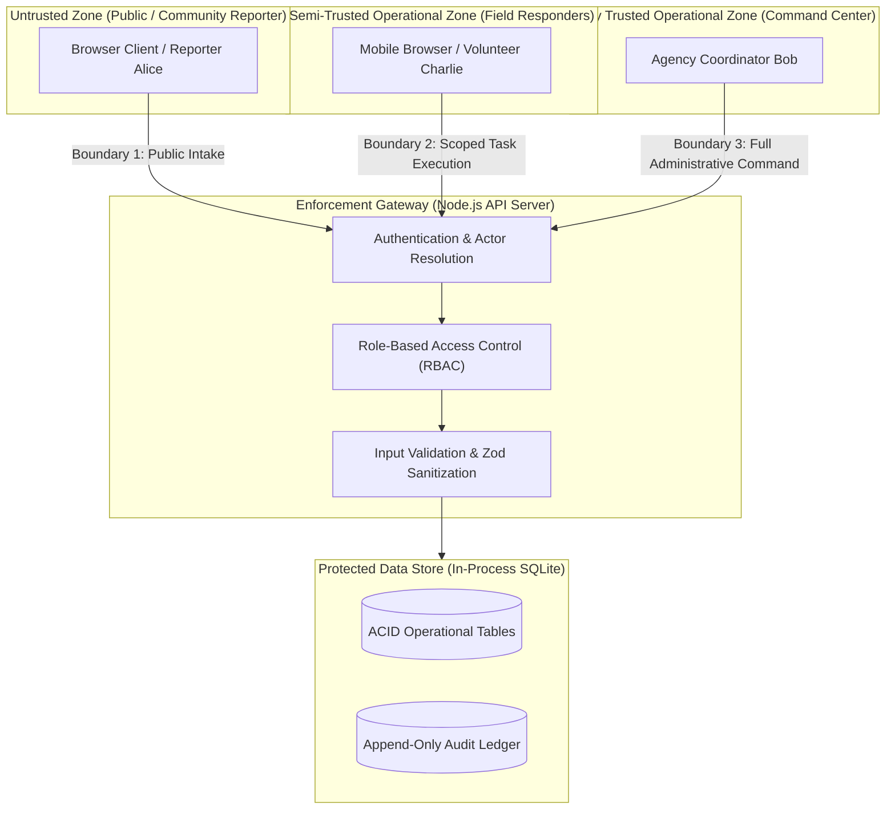

# Crisis Response Platform — Application Security Specification

**Document:** `docs/07-Technical_Design/06-Security.md`  
**System:** Verified Response Ledger (VRL)  
**Stage:** Step 7 — Technical Design  
**Date:** 20 September 2026  
**Status:** Frozen Technical Specification  

---

# 1. Security Boundaries & Trust Zones

The platform architecture enforces three distinct trust zones separated by explicit security boundaries:



### Trust Boundary Definitions:
1. **Boundary 1 (Public / Reporter):** Low trust. Reporters may submit new reports and query only their own reference code. They are strictly prohibited from querying internal queues, inventory levels, responder identities, or internal audit logs.
2. **Boundary 2 (Responder):** Scoped operational trust. Responders may only inspect and mutate tasks explicitly assigned to their specific user ID (`req.actor.id === task.assigned_to`). They cannot view global depot balances or modify other responders' tasks.
3. **Boundary 3 (Coordinator):** High operational trust. Authorized coordinators have full operational authority to verify reports, allocate inventory, assign tasks, and review audit timelines. They cannot bypass state machine constraints or delete audit history.

---

# 2. Authentication Model

### Prototype Implementation: Header-Based Identity Resolution
To maximize hackathon evaluation speed while maintaining strict role boundaries, the prototype uses an **Actor Context Header Model**:
- Incoming requests provide:
  - `X-Actor-ID`: Fictional user identifier (`alice`, `bob`, `charlie`).
  - `X-Actor-Role`: Operational role (`REPORTER`, `COORDINATOR`, `RESPONDER`).
- An authentication middleware verifies that the user exists in the prepared `users` table and is marked `is_active = 1`.
- Requests lacking headers default to `REPORTER` (public guest) context for `/api/reports` submissions, but are rejected with `401 Unauthorized` for protected routes.

### Production Evolution: OIDC & Cryptographic JWTs
In an enterprise deployment, this mock header switcher is replaced by:
- OpenID Connect (OIDC) / OAuth 2.0 PKCE authentication backed by Keycloak or an agency Single Sign-On (SSO) provider.
- Short-lived, cryptographically signed RS256 JWT access tokens passed via `Authorization: Bearer <token>` headers.
- Multi-factor authentication (MFA) required for all Coordinator and Dispatcher roles.

---

# 3. Server-Side Authorization Matrix

Authorization is enforced exclusively on the backend server. The frontend hides buttons for UX clarity, but the backend rejects any unauthorized direct API call:

| Endpoint Pattern | Method | Permitted Roles | Resource-Level Ownership Guard | Failure Response |
|---|:---:|---|---|:---:|
| `/api/reports` | `POST` | `REPORTER`, `COORDINATOR` | None (Public intake permitted). | 400 |
| `/api/reports/:ref` | `GET` | `REPORTER`, `COORDINATOR` | Must match report's assigned tracking reference. | 404 |
| `/api/reports` | `GET` | `COORDINATOR` | Global access (Coordinator queue). | 403 |
| `/api/reports/:id/verify` | `POST` | `COORDINATOR` | Only coordinator can verify or reject reports. | 403 |
| `/api/resources` | `GET` | `COORDINATOR` | Full depot availability view restricted to coordinators. | 403 |
| `/api/incidents/:id/reserve`| `POST` | `COORDINATOR` | Only coordinator can execute inventory commitments. | 403 |
| `/api/tasks` | `POST` | `COORDINATOR` | Only coordinator can assign operational work. | 403 |
| `/api/tasks` | `GET` | `COORDINATOR`, `RESPONDER` | Responders only receive tasks where `assigned_to == actor.id`. | 403 |
| `/api/tasks/:id/acknowledge`| `POST`| `RESPONDER` | Must satisfy `task.assigned_to == actor.id`. | 403 |
| `/api/tasks/:id/dispatch` | `POST` | `RESPONDER` | Must satisfy `task.assigned_to == actor.id`. | 403 |
| `/api/tasks/:id/outcome` | `POST` | `RESPONDER` | Must satisfy `task.assigned_to == actor.id`. | 403 |
| `/api/incidents/:id/confirm`| `POST` | `COORDINATOR` | Only coordinator can reconcile outcomes. | 403 |
| `/api/audit` | `GET` | `COORDINATOR` | Full system audit trail restricted to coordinators. | 403 |

---

# 4. Input Validation & Trust Sanitization

All incoming request payloads pass through strict Zod schemas before being processed by controllers:

```typescript
// Example: Strict Incident Report Schema
export const SubmitReportSchema = z.object({
  location_name: z.string().trim().min(3).max(120),
  latitude: z.number().min(-90.0).max(90.0),
  longitude: z.number().min(-180.0).max(180.0),
  incident_type: z.enum([
    'FLOOD',
    'STRUCTURAL_DAMAGE',
    'MEDICAL_EMERGENCY',
    'ROAD_BLOCKAGE',
    'SUPPLY_SHORTAGE'
  ]),
  reporter_severity: z.enum(['LOW', 'MEDIUM', 'HIGH', 'CRITICAL']),
  description: z.string().trim().min(5).max(1000),
  contact_safe: z.string().trim().max(100).default('Anonymous Demo Reporter')
});
```

### Sanitization Rules:
- **String Stripping:** All string inputs are trimmed and stripped of potential HTML tags to neutralize Cross-Site Scripting (XSS).
- **Coordinate Clamping:** Geographic coordinates outside valid mathematical ranges are immediately rejected.
- **Strict Integer Quantities:** All inventory quantities must be strictly positive whole numbers (`z.number().int().positive()`).

---

# 5. Sensitive Data & Privacy Governance

| Data Field | Sensitivity Classification | Prototype Storage Treatment | Privacy Protection Rule |
|---|---|---|---|
| **Victim PII (Names, Phone Nos)** | Highly Sensitive | **Zero Real PII Collected.** Only synthetic test identifiers (e.g., "Alice Demo Contact") are accepted. | Field explicitly labelled "Safe Demo Contact"; PRD Section 15 strictly prohibits collecting real victim PII. |
| **Incident Coordinates** | Medium Sensitivity | Stored as standard latitude/longitude floats. | Public reporter tracking view exposes only approximate neighborhood names (`location_name`), not exact lat/long. |
| **Depot Inventory Balance** | Operational Sensitive | Stored in `resource_pools`. | Never exposed to public reporters; accessible only to verified Coordinators. |
| **Audit Logs** | High Integrity | Stored in immutable `audit_events`. | Read-only access; no endpoints permit editing or deleting audit events. |

---

# 6. Secrets Management

- **Local Prototype:** Zero cloud credentials required. Database is local SQLite file. The application runs cleanly without any external API keys or cloud tokens.
- **Environment Configuration:** All runtime parameters (e.g., `PORT=3000`, `NODE_ENV=development`) are loaded via local `.env` files.
- **Repository Safety:** The `.gitignore` file explicitly blocks `.env`, `*.db`, `*.sqlite`, and credential files from entering source control.

---

# 7. Common Web Application Risks & Mitigations (OWASP Top 10)

| Risk (OWASP) | Potential Vulnerability in Crisis Apps | Prototype Technical Mitigation |
|---|---|---|
| **SQL Injection (SQLi)** | Malicious SQL in description or location fields. | **100% Parameterized Queries:** All database interactions use prepared statements via `better-sqlite3` (`db.prepare('... WHERE id = ?').run(val)`). Raw string concatenation is strictly banned. |
| **Cross-Site Scripting (XSS)** | Malicious scripts injected into report descriptions. | React automatically escapes string values rendered in JSX. Input strings are sanitized at the API layer. |
| **Broken Object-Level Auth (BOLA / IDOR)** | Responder Charlie modifies task assigned to Responder David by tampering with task ID in URL. | Controller explicitly asserts: `if (task.assigned_to !== req.actor.id) throw new ForbiddenError()`. |
| **Race Condition Exploitation** | Rapidly submitting multiple allocation requests to steal more inventory than available. | Atomic conditional SQL update (`UPDATE ... WHERE available >= ?`) guarantees serialized execution without overcommitment. |
| **Denial of Service (DoS)** | Client floods report intake with massive JSON payloads. | Express JSON body parser limits payload size to `100kb`. |

---

# 8. Auditability & Non-Repudiation

1. **Tamper-Evident Design:** The `audit_events` table contains no `UPDATE` or `DELETE` triggers or SQL statements anywhere in the codebase.
2. **Actor Attribution:** Every state-modifying action records the responsible `actor_id` and `actor_role`.
3. **State Deltas:** The audit record stores a snapshot of the modified fields, ensuring post-incident forensic review can trace exactly who authorized an allocation, when it was dispatched, and why an exception was filed.

---

# 9. Prototype vs. Production Security Controls

| Security Dimension | Hackathon Prototype Specification | Production Enterprise Standard |
|---|---|---|
| **Authentication** | Local Header Actor Switcher (`X-Actor-Role`) | OAuth 2.0 / OIDC with hardware token MFA (FIDO2 / WebAuthn) |
| **Transport Encryption** | Localhost HTTP (or self-signed HTTPS) | Mandatory TLS 1.3 with Strict-Transport-Security (HSTS) |
| **Data Encryption at Rest** | Unencrypted local SQLite file | AES-256 encrypted database volumes (AWS KMS / LUKS) |
| **Rate Limiting** | In-memory token bucket middleware (100 req/min) | Distributed rate limiting via Cloudflare / AWS WAF |
| **Audit Log Protection** | Append-only SQLite table | Write-Once-Read-Many (WORM) S3 bucket with Merkle-tree cryptographic proofs |
| **Vulnerability Scanning** | Manual code review & automated TypeScript checks | Automated Snyk / Dependabot dependency scanning and SAST in CI/CD pipeline |
